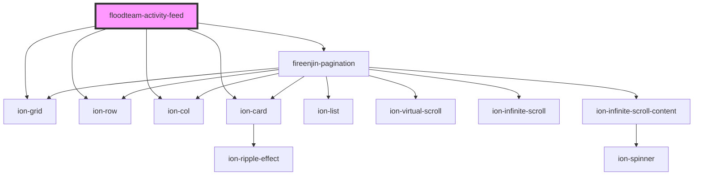

# floodteam-activity-feed

<!-- Auto Generated Below -->

## Properties

| Property | Attribute | Description | Type     | Default     |
| -------- | --------- | ----------- | -------- | ----------- |
| `jobId`  | `job-id`  |             | `string` | `undefined` |
| `siteId` | `site-id` |             | `string` | `undefined` |
| `userId` | `user-id` |             | `string` | `undefined` |

## Events

| Event              | Description | Type               |
| ------------------ | ----------- | ------------------ |
| `fireenjinTrigger` |             | `CustomEvent<any>` |

## Dependencies

### Depends on

- ion-grid
- ion-row
- ion-col
- fireenjin-pagination
- ion-card

### Graph

----------------------------------------------

*Built with [StencilJS](https://stenciljs.com/)*
