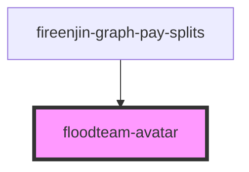

# floodteam-avatar

<!-- Auto Generated Below -->

## Properties

| Property   | Attribute  | Description | Type     | Default     |
| ---------- | ---------- | ----------- | -------- | ----------- |
| `initials` | `initials` |             | `string` | `undefined` |
| `size`     | `size`     |             | `string` | `undefined` |
| `src`      | `src`      |             | `string` | `undefined` |

## Dependencies

### Used by

 - [fireenjin-graph-pay-splits](../graph-pay-splits)

### Graph

----------------------------------------------

*Built with [StencilJS](https://stenciljs.com/)*
