# floodteam-book-now

<!-- Auto Generated Below -->

## Properties

| Property        | Attribute         | Description                  | Type      | Default     |
| --------------- | ----------------- | ---------------------------- | --------- | ----------- |
| `googleMapsKey` | `google-maps-key` | The Google Maps API Key      | `any`     | `undefined` |
| `locationId`    | `location-id`     | The ID of the location       | `string`  | `undefined` |
| `referralId`    | `referral-id`     | The ID of the referring user | `string`  | `undefined` |
| `referring`     | `referring`       | Is the user referring?       | `boolean` | `false`     |
| `token`         | `token`           | The campaign or API token    | `string`  | `undefined` |

## Dependencies

### Depends on

- ion-card
- [floodteam-error](../error)
- fireenjin-form
- ion-list
- fireenjin-input
- fireenjin-input-address
- [floodteam-checkmark](../checkmark)
- ion-grid
- ion-row
- ion-col
- ion-label
- ion-button
- ion-icon

### Graph

```mermaid
graph TD;
  floodteam-book-now --> ion-card
  floodteam-book-now --> floodteam-error
  floodteam-book-now --> fireenjin-form
  floodteam-book-now --> ion-list
  floodteam-book-now --> fireenjin-input
  floodteam-book-now --> fireenjin-input-address
  floodteam-book-now --> floodteam-checkmark
  floodteam-book-now --> ion-grid
  floodteam-book-now --> ion-row
  floodteam-book-now --> ion-col
  floodteam-book-now --> ion-label
  floodteam-book-now --> ion-button
  floodteam-book-now --> ion-icon
  ion-card --> ion-ripple-effect
  floodteam-error --> ion-item
  floodteam-error --> ion-icon
  floodteam-error --> ion-label
  ion-item --> ion-icon
  ion-item --> ion-ripple-effect
  ion-item --> ion-note
  fireenjin-form --> ion-grid
  fireenjin-form --> ion-row
  fireenjin-form --> ion-col
  fireenjin-form --> ion-button
  ion-button --> ion-ripple-effect
  fireenjin-input --> ion-input
  fireenjin-input --> ion-item
  fireenjin-input --> ion-icon
  fireenjin-input --> ion-label
  fireenjin-input-address --> ion-item
  fireenjin-input-address --> ion-label
  fireenjin-input-address --> ion-input
  fireenjin-input-address --> ion-grid
  fireenjin-input-address --> ion-row
  fireenjin-input-address --> ion-col
  fireenjin-input-address --> fireenjin-input-state
  fireenjin-input-address --> ion-button
  fireenjin-input-state --> ion-select
  fireenjin-input-state --> ion-select-option
  ion-select --> ion-select-popover
  ion-select --> ion-popover
  ion-select --> ion-action-sheet
  ion-select --> ion-alert
  ion-select-popover --> ion-item
  ion-select-popover --> ion-checkbox
  ion-select-popover --> ion-label
  ion-select-popover --> ion-radio-group
  ion-select-popover --> ion-radio
  ion-select-popover --> ion-list
  ion-select-popover --> ion-list-header
  ion-popover --> ion-backdrop
  ion-action-sheet --> ion-backdrop
  ion-action-sheet --> ion-icon
  ion-action-sheet --> ion-ripple-effect
  ion-alert --> ion-ripple-effect
  ion-alert --> ion-backdrop
  floodteam-checkmark --> ion-icon
  style floodteam-book-now fill:#f9f,stroke:#333,stroke-width:4px
```

----------------------------------------------

*Built with [StencilJS](https://stenciljs.com/)*
