# floodteam-epay

<!-- Auto Generated Below -->

## Properties

| Property    | Attribute    | Description                                  | Type                                                                         | Default     |
| ----------- | ------------ | -------------------------------------------- | ---------------------------------------------------------------------------- | ----------- |
| `customer`  | `customer`   |                                              | `any`                                                                        | `{}`        |
| `dadeKey`   | `dade-key`   |                                              | `string`                                                                     | `undefined` |
| `dadeUrl`   | `dade-url`   |                                              | `string`                                                                     | `undefined` |
| `error`     | `error`      | The error message to display                 | `string`                                                                     | `undefined` |
| `isAdmin`   | `is-admin`   |                                              | `boolean`                                                                    | `true`      |
| `jobId`     | `job-id`     |                                              | `string`                                                                     | `undefined` |
| `owed`      | `owed`       | The amount of money owed                     | `any`                                                                        | `0`         |
| `paymentId` | `payment-id` |                                              | `string`                                                                     | `undefined` |
| `payments`  | --           | The list of payments                         | `{ timestamp: string; brand: string; last4: number; amount: number; }[]`     | `[]`        |
| `showSlide` | `show-slide` | The slide to show when loading the component | `"card" \| "check" \| "confirmation" \| "details" \| "payments" \| "report"` | `undefined` |
| `stripeKey` | `stripe-key` |                                              | `string`                                                                     | `undefined` |
| `total`     | `total`      | The total amount of money billed             | `any`                                                                        | `0`         |
| `tracking`  | `tracking`   |                                              | `boolean`                                                                    | `false`     |
| `userId`    | `user-id`    |                                              | `string`                                                                     | `undefined` |
| `users`     | --           |                                              | `any[]`                                                                      | `[]`        |

## Events

| Event                  | Description | Type               |
| ---------------------- | ----------- | ------------------ |
| `fireenjinFetch`       |             | `CustomEvent<any>` |
| `fireenjinSubmit`      |             | `CustomEvent<any>` |
| `ftEpayShowCommisions` |             | `CustomEvent<any>` |

## Methods

### `confirmPayment(options?: any) => Promise<any>`

Confirm a check payment

#### Returns

Type: `Promise<any>`

### `reset() => Promise<void>`

#### Returns

Type: `Promise<void>`

### `success() => Promise<void>`

#### Returns

Type: `Promise<void>`

### `updateSlides() => Promise<void>`

Update the ion-slides height

#### Returns

Type: `Promise<void>`

## Dependencies

### Depends on

- ion-card
- ion-button
- ion-icon
- [floodteam-progress-bar](../progress-bar)
- ion-slides
- ion-slide
- ion-grid
- ion-row
- ion-col
- ion-item
- ion-label
- [floodteam-fallback](../fallback)
- ion-list
- [floodteam-input](../input)
- [floodteam-pay-card](../pay-card)
- [floodteam-pay-check](../pay-check)
- [floodteam-error](../error)
- [floodteam-progress-circle](../progress-circle)
- [floodteam-checkmark](../checkmark)

### Graph

```mermaid
graph TD;
  floodteam-epay --> ion-card
  floodteam-epay --> ion-button
  floodteam-epay --> ion-icon
  floodteam-epay --> floodteam-progress-bar
  floodteam-epay --> ion-slides
  floodteam-epay --> ion-slide
  floodteam-epay --> ion-grid
  floodteam-epay --> ion-row
  floodteam-epay --> ion-col
  floodteam-epay --> ion-item
  floodteam-epay --> ion-label
  floodteam-epay --> floodteam-fallback
  floodteam-epay --> ion-list
  floodteam-epay --> floodteam-input
  floodteam-epay --> floodteam-pay-card
  floodteam-epay --> floodteam-pay-check
  floodteam-epay --> floodteam-error
  floodteam-epay --> floodteam-progress-circle
  floodteam-epay --> floodteam-checkmark
  ion-card --> ion-ripple-effect
  ion-button --> ion-ripple-effect
  ion-item --> ion-icon
  ion-item --> ion-ripple-effect
  floodteam-fallback --> ion-icon
  floodteam-input --> ion-input
  floodteam-input --> ion-item
  floodteam-input --> ion-icon
  floodteam-input --> ion-label
  floodteam-pay-card --> floodteam-error
  floodteam-pay-card --> ion-grid
  floodteam-pay-card --> ion-row
  floodteam-pay-card --> ion-col
  floodteam-pay-card --> ion-button
  floodteam-error --> ion-item
  floodteam-error --> ion-icon
  floodteam-error --> ion-label
  floodteam-pay-check --> floodteam-error
  floodteam-pay-check --> floodteam-flip-card
  floodteam-pay-check --> ion-grid
  floodteam-pay-check --> ion-row
  floodteam-pay-check --> ion-col
  floodteam-pay-check --> ion-button
  floodteam-flip-card --> ion-icon
  floodteam-checkmark --> ion-icon
  style floodteam-epay fill:#f9f,stroke:#333,stroke-width:4px
```

----------------------------------------------

*Built with [StencilJS](https://stenciljs.com/)*
