# floodteam-epay

<!-- Auto Generated Below -->

## Properties

| Property        | Attribute        | Description                                  | Type                                                                         | Default     |
| --------------- | ---------------- | -------------------------------------------- | ---------------------------------------------------------------------------- | ----------- |
| `customer`      | `customer`       |                                              | `any`                                                                        | `{}`        |
| `dadeKey`       | `dade-key`       |                                              | `string`                                                                     | `undefined` |
| `dadeUrl`       | `dade-url`       |                                              | `string`                                                                     | `undefined` |
| `disableFetch`  | `disable-fetch`  |                                              | `boolean`                                                                    | `false`     |
| `error`         | `error`          | The error message to display                 | `string`                                                                     | `undefined` |
| `job`           | `job`            |                                              | `any`                                                                        | `undefined` |
| `jobId`         | `job-id`         |                                              | `string`                                                                     | `undefined` |
| `owed`          | `owed`           | The amount of money owed                     | `any`                                                                        | `0`         |
| `paymentId`     | `payment-id`     |                                              | `string`                                                                     | `undefined` |
| `paymentMethod` | `payment-method` |                                              | `"ach" \| "card" \| "check" \| "manual"`                                     | `"card"`    |
| `paymentType`   | `payment-type`   |                                              | `"codeblue" \| "insurance"`                                                  | `undefined` |
| `payments`      | --               | The list of payments                         | `{ timestamp: string; brand: string; last4: number; amount: number; }[]`     | `[]`        |
| `showSlide`     | `show-slide`     | The slide to show when loading the component | `"card" \| "check" \| "confirmation" \| "details" \| "payments" \| "report"` | `undefined` |
| `stripeKey`     | `stripe-key`     |                                              | `string`                                                                     | `undefined` |
| `total`         | `total`          | The total amount of money billed             | `any`                                                                        | `0`         |
| `userId`        | `user-id`        |                                              | `string`                                                                     | `undefined` |
| `users`         | --               |                                              | `any[]`                                                                      | `[]`        |

## Events

| Event                  | Description | Type               |
| ---------------------- | ----------- | ------------------ |
| `fireenjinFetch`       |             | `CustomEvent<any>` |
| `fireenjinSubmit`      |             | `CustomEvent<any>` |
| `ftEpayShowCommisions` |             | `CustomEvent<any>` |

## Methods

### `confirmPayment(options?: any) => Promise<any>`

Confirm a check payment

#### Returns

Type: `Promise<any>`

### `reset() => Promise<void>`

#### Returns

Type: `Promise<void>`

### `success() => Promise<void>`

#### Returns

Type: `Promise<void>`

### `takePayment() => Promise<void>`

#### Returns

Type: `Promise<void>`

### `updateSlides() => Promise<void>`

Update the ion-slides height

#### Returns

Type: `Promise<void>`

## Dependencies

### Depends on

- ion-card
- ion-slides
- ion-slide
- ion-grid
- ion-row
- ion-col
- ion-item
- ion-label
- [floodteam-fallback](../fallback)
- ion-button
- fireenjin-form
- fireenjin-input-amount
- fireenjin-input
- fireenjin-select
- fireenjin-toggle
- [floodteam-error](../error)
- ion-list
- ion-icon
- [floodteam-checkmark](../checkmark)

### Graph

```mermaid
graph TD;
  floodteam-epay --> ion-card
  floodteam-epay --> ion-slides
  floodteam-epay --> ion-slide
  floodteam-epay --> ion-grid
  floodteam-epay --> ion-row
  floodteam-epay --> ion-col
  floodteam-epay --> ion-item
  floodteam-epay --> ion-label
  floodteam-epay --> floodteam-fallback
  floodteam-epay --> ion-button
  floodteam-epay --> fireenjin-form
  floodteam-epay --> fireenjin-input-amount
  floodteam-epay --> fireenjin-input
  floodteam-epay --> fireenjin-select
  floodteam-epay --> fireenjin-toggle
  floodteam-epay --> floodteam-error
  floodteam-epay --> ion-list
  floodteam-epay --> ion-icon
  floodteam-epay --> floodteam-checkmark
  ion-card --> ion-ripple-effect
  ion-item --> ion-icon
  ion-item --> ion-ripple-effect
  ion-item --> ion-note
  floodteam-fallback --> ion-icon
  ion-button --> ion-ripple-effect
  fireenjin-form --> ion-grid
  fireenjin-form --> ion-row
  fireenjin-form --> ion-col
  fireenjin-form --> ion-button
  fireenjin-input-amount --> ion-item
  fireenjin-input-amount --> ion-icon
  fireenjin-input-amount --> ion-label
  fireenjin-input-amount --> ion-input
  fireenjin-input --> ion-input
  fireenjin-input --> ion-item
  fireenjin-input --> ion-icon
  fireenjin-input --> ion-label
  fireenjin-select --> ion-item
  fireenjin-select --> ion-icon
  fireenjin-select --> ion-label
  fireenjin-select --> ion-select
  fireenjin-select --> ion-select-option
  ion-select --> ion-select-popover
  ion-select --> ion-popover
  ion-select --> ion-action-sheet
  ion-select --> ion-alert
  ion-select-popover --> ion-item
  ion-select-popover --> ion-checkbox
  ion-select-popover --> ion-label
  ion-select-popover --> ion-radio-group
  ion-select-popover --> ion-radio
  ion-select-popover --> ion-list
  ion-select-popover --> ion-list-header
  ion-popover --> ion-backdrop
  ion-action-sheet --> ion-backdrop
  ion-action-sheet --> ion-icon
  ion-action-sheet --> ion-ripple-effect
  ion-alert --> ion-ripple-effect
  ion-alert --> ion-backdrop
  fireenjin-toggle --> ion-item
  fireenjin-toggle --> ion-label
  fireenjin-toggle --> ion-toggle
  ion-toggle --> ion-icon
  floodteam-error --> ion-item
  floodteam-error --> ion-icon
  floodteam-error --> ion-label
  floodteam-checkmark --> ion-icon
  style floodteam-epay fill:#f9f,stroke:#333,stroke-width:4px
```

----------------------------------------------

*Built with [StencilJS](https://stenciljs.com/)*
