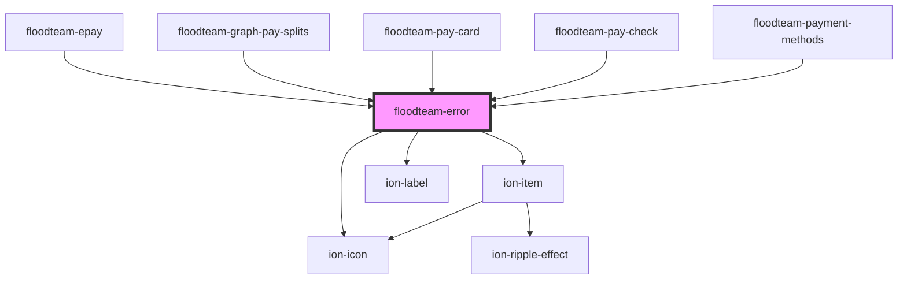

# floodteam-error

<!-- Auto Generated Below -->

## Properties

| Property   | Attribute   | Description                  | Type     | Default                  |
| ---------- | ----------- | ---------------------------- | -------- | ------------------------ |
| `color`    | `color`     | The color of the component   | `string` | `"danger"`               |
| `iconName` | `icon-name` | The icon to use              | `string` | `"alert-circle-outline"` |
| `message`  | `message`   | The error message to display | `string` | `undefined`              |

## Dependencies

### Used by

 - [floodteam-epay](../epay)
 - [floodteam-graph-pay-splits](../graph-pay-splits)
 - [floodteam-pay-card](../pay-card)
 - [floodteam-pay-check](../pay-check)
 - [floodteam-payment-methods](../payment-methods)

### Depends on

- ion-item
- ion-icon
- ion-label

### Graph

----------------------------------------------

*Built with [StencilJS](https://stenciljs.com/)*
