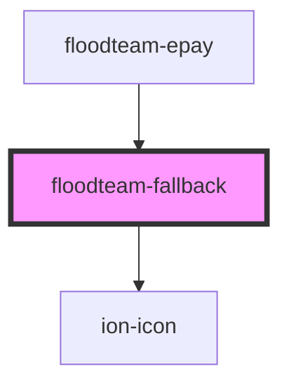

# floodteam-fallback

<!-- Auto Generated Below -->

## Properties

| Property  | Attribute | Description                                   | Type     | Default     |
| --------- | --------- | --------------------------------------------- | -------- | ----------- |
| `icon`    | `icon`    | An icon to display above the fallback message | `string` | `undefined` |
| `message` | `message` | The message to display as a fallback          | `string` | `undefined` |

## Dependencies

### Used by

 - [floodteam-epay](../epay)

### Depends on

- ion-icon

### Graph

----------------------------------------------

*Built with [StencilJS](https://stenciljs.com/)*
