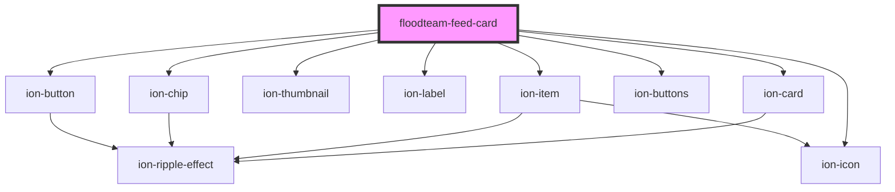

# floodteam-feed-card

<!-- Auto Generated Below -->

## Properties

| Property          | Attribute          | Description                                                  | Type                                                                                                                                                                                                     | Default     |
| ----------------- | ------------------ | ------------------------------------------------------------ | -------------------------------------------------------------------------------------------------------------------------------------------------------------------------------------------------------- | ----------- |
| `actionButtons`   | --                 | An optional action button to show on the card                | `{ action: string; size?: "small" \| "default" \| "large"; fill?: "default" \| "clear" \| "outline" \| "solid"; color?: string; iconStart?: string; iconEnd?: string; text?: string; href?: string; }[]` | `undefined` |
| `backgroundImage` | `background-image` | The background image to use for the card                     | `string`                                                                                                                                                                                                 | `undefined` |
| `createdAt`       | --                 | When the feed item was created                               | `Date`                                                                                                                                                                                                   | `undefined` |
| `details`         | `details`          | The more in depth details about the feed card                | `string`                                                                                                                                                                                                 | `undefined` |
| `heading`         | `heading`          | The main text at the top of the feed card                    | `string`                                                                                                                                                                                                 | `undefined` |
| `image`           | `image`            | The image to display at the top left of the feed card        | `string`                                                                                                                                                                                                 | `undefined` |
| `modal`           | `modal`            | The component to load into a modal that will display on load | `string`                                                                                                                                                                                                 | `undefined` |
| `payload`         | `payload`          | Payload data to send through the feed card                   | `any`                                                                                                                                                                                                    | `undefined` |
| `read`            | `read`             | Whether the message has been read                            | `boolean`                                                                                                                                                                                                | `undefined` |
| `subtext`         | `subtext`          | The subtext to display under the title                       | `string`                                                                                                                                                                                                 | `undefined` |
| `tags`            | --                 | A list of tags that apply to this feed card                  | `string[]`                                                                                                                                                                                               | `undefined` |

## Events

| Event                 | Description | Type               |
| --------------------- | ----------- | ------------------ |
| `floodteamFeedAction` |             | `CustomEvent<any>` |

## Dependencies

### Depends on

- ion-card
- ion-item
- ion-thumbnail
- ion-label
- ion-chip
- ion-buttons
- ion-button
- ion-icon

### Graph

----------------------------------------------

*Built with [StencilJS](https://stenciljs.com/)*
