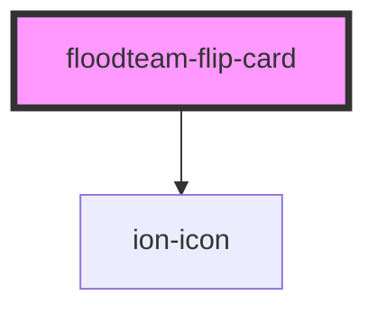

# floodteam-flip-card

<!-- Auto Generated Below -->

## Properties

| Property      | Attribute      | Description | Type      | Default     |
| ------------- | -------------- | ----------- | --------- | ----------- |
| `backImage`   | `back-image`   |             | `string`  | `undefined` |
| `flipped`     | `flipped`      |             | `boolean` | `false`     |
| `frontImage`  | `front-image`  |             | `string`  | `undefined` |
| `hideRefresh` | `hide-refresh` |             | `boolean` | `false`     |

## Events

| Event           | Description | Type               |
| --------------- | ----------- | ------------------ |
| `floodteamFlip` |             | `CustomEvent<any>` |

## Methods

### `flip(event?: any) => Promise<void>`

#### Returns

Type: `Promise<void>`

## Dependencies

### Depends on

- ion-icon

### Graph

----------------------------------------------

*Built with [StencilJS](https://stenciljs.com/)*
