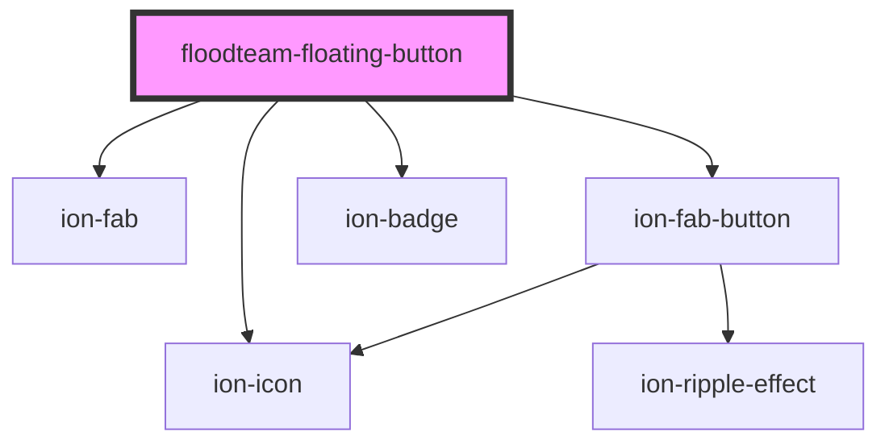

# floodteam-floating-button

<!-- Auto Generated Below -->

## Properties

| Property     | Attribute     | Description                                                     | Type                                                                                               | Default               |
| ------------ | ------------- | --------------------------------------------------------------- | -------------------------------------------------------------------------------------------------- | --------------------- |
| `badge`      | `badge`       | The content of the badge                                        | `string`                                                                                           | `undefined`           |
| `badgeColor` | `badge-color` | The color of the badge to display                               | `string`                                                                                           | `"success"`           |
| `buttonList` | --            | The list of buttons to show when the material button is clicked | `{ label: string; icon: string; color?: string; href?: string; onClick?: (event: any) => any; }[]` | `[]`                  |
| `color`      | `color`       | The color of the button                                         | `string`                                                                                           | `undefined`           |
| `horizontal` | `horizontal`  | The horizontal position of the button                           | `"center" \| "end" \| "start"`                                                                     | `"end"`               |
| `listSide`   | `list-side`   | The side the list should display                                | `"bottom" \| "end" \| "start" \| "top"`                                                            | `"bottom"`            |
| `openIcon`   | `open-icon`   | The icon to use on the material button when it's closed         | `string`                                                                                           | `"ellipsis-vertical"` |
| `url`        | `url`         | The url to link the material button to                          | `string`                                                                                           | `undefined`           |
| `vertical`   | `vertical`    | The vertical position of the button                             | `"bottom" \| "center" \| "top"`                                                                    | `"center"`            |

## Dependencies

### Depends on

- ion-fab
- ion-fab-button
- ion-icon
- ion-badge

### Graph

----------------------------------------------

*Built with [StencilJS](https://stenciljs.com/)*
