# floodteam-payment-flow

<!-- Auto Generated Below -->

## Properties

| Property      | Attribute      | Description | Type                                                                                                                                                                                                                                                                                                                                                                                                                                                                                                                                                                                                                                                                                                                                                                                                                                                  | Default          |
| ------------- | -------------- | ----------- | ----------------------------------------------------------------------------------------------------------------------------------------------------------------------------------------------------------------------------------------------------------------------------------------------------------------------------------------------------------------------------------------------------------------------------------------------------------------------------------------------------------------------------------------------------------------------------------------------------------------------------------------------------------------------------------------------------------------------------------------------------------------------------------------------------------------------------------------------------- | ---------------- |
| `amount`      | `amount`       |             | `number`                                                                                                                                                                                                                                                                                                                                                                                                                                                                                                                                                                                                                                                                                                                                                                                                                                              | `null`           |
| `checkAmount` | `check-amount` |             | `number`                                                                                                                                                                                                                                                                                                                                                                                                                                                                                                                                                                                                                                                                                                                                                                                                                                              | `undefined`      |
| `checkBack`   | `check-back`   |             | `string`                                                                                                                                                                                                                                                                                                                                                                                                                                                                                                                                                                                                                                                                                                                                                                                                                                              | `null`           |
| `checkFront`  | `check-front`  |             | `string`                                                                                                                                                                                                                                                                                                                                                                                                                                                                                                                                                                                                                                                                                                                                                                                                                                              | `null`           |
| `currentPath` | `current-path` |             | `string`                                                                                                                                                                                                                                                                                                                                                                                                                                                                                                                                                                                                                                                                                                                                                                                                                                              | `"payingCard"`   |
| `currentStep` | `current-step` |             | `string`                                                                                                                                                                                                                                                                                                                                                                                                                                                                                                                                                                                                                                                                                                                                                                                                                                              | `"paymentIntro"` |
| `email`       | `email`        |             | `string`                                                                                                                                                                                                                                                                                                                                                                                                                                                                                                                                                                                                                                                                                                                                                                                                                                              | `null`           |
| `jobId`       | `job-id`       |             | `string`                                                                                                                                                                                                                                                                                                                                                                                                                                                                                                                                                                                                                                                                                                                                                                                                                                              | `undefined`      |
| `method`      | `method`       |             | `string`                                                                                                                                                                                                                                                                                                                                                                                                                                                                                                                                                                                                                                                                                                                                                                                                                                              | `"card"`         |
| `user`        | --             |             | `{ __typename?: "User"; active?: boolean; address?: Address; billingAddress?: Address; birthday?: string; certifications?: Certification[]; company?: Company; createdAt?: string; createdBy?: User; email?: string; feed?: Feed[]; firstName?: string; floodbotId?: string; friends?: User[]; id?: string; isFranchise?: boolean; isFranchiseOwner?: boolean; isOnboarded?: boolean; isSearchable?: boolean; isSetup?: boolean; isStripeOAuth?: boolean; jobs?: Job[]; lastName?: string; lastNotifiedAt?: string; lastOnline?: string; location?: Location; online?: boolean; phone?: string; photo?: string; plaidAccessToken?: string; rating?: number; referredBy?: User; role?: string; slackHandle?: string; stripeId?: string; tags?: string[]; trade?: string; type?: string; updatedAt?: string; updatedBy?: User; vehicles?: Vehicle[]; }` | `{}`             |

## Methods

### `setPath(path?: string) => Promise<Step[]>`

Set the path of the flow d

#### Returns

Type: `Promise<Step[]>`

A list of steps for the current path

## Dependencies

### Depends on

- ion-progress-bar
- fireenjin-flow
- ion-icon
- ion-button

### Graph

```mermaid
graph TD;
  floodteam-payment-flow --> ion-progress-bar
  floodteam-payment-flow --> fireenjin-flow
  floodteam-payment-flow --> ion-icon
  floodteam-payment-flow --> ion-button
  fireenjin-flow --> fireenjin-input-file
  fireenjin-flow --> fireenjin-input-photo
  fireenjin-flow --> fireenjin-input-address
  fireenjin-flow --> fireenjin-select
  fireenjin-flow --> fireenjin-radios
  fireenjin-flow --> fireenjin-input-search
  fireenjin-flow --> fireenjin-checklist
  fireenjin-flow --> fireenjin-input
  fireenjin-flow --> fireenjin-form
  fireenjin-flow --> ion-slides
  fireenjin-flow --> ion-slide
  fireenjin-flow --> ion-button
  fireenjin-flow --> ion-icon
  fireenjin-flow --> ion-label
  fireenjin-input-file --> ion-card
  fireenjin-input-file --> ion-item
  fireenjin-input-file --> ion-icon
  ion-card --> ion-ripple-effect
  ion-item --> ion-icon
  ion-item --> ion-ripple-effect
  ion-item --> ion-note
  fireenjin-input-photo --> ion-button
  fireenjin-input-photo --> ion-icon
  ion-button --> ion-ripple-effect
  fireenjin-input-address --> ion-item
  fireenjin-input-address --> ion-label
  fireenjin-input-address --> ion-input
  fireenjin-input-address --> ion-grid
  fireenjin-input-address --> ion-row
  fireenjin-input-address --> ion-col
  fireenjin-input-address --> fireenjin-input-state
  fireenjin-input-address --> ion-button
  fireenjin-input-state --> ion-select
  fireenjin-input-state --> ion-select-option
  ion-select --> ion-select-popover
  ion-select --> ion-popover
  ion-select --> ion-action-sheet
  ion-select --> ion-alert
  ion-select-popover --> ion-item
  ion-select-popover --> ion-checkbox
  ion-select-popover --> ion-label
  ion-select-popover --> ion-radio-group
  ion-select-popover --> ion-radio
  ion-select-popover --> ion-list
  ion-select-popover --> ion-list-header
  ion-popover --> ion-backdrop
  ion-action-sheet --> ion-backdrop
  ion-action-sheet --> ion-icon
  ion-action-sheet --> ion-ripple-effect
  ion-alert --> ion-ripple-effect
  ion-alert --> ion-backdrop
  fireenjin-select --> ion-item
  fireenjin-select --> ion-icon
  fireenjin-select --> ion-label
  fireenjin-select --> ion-select
  fireenjin-select --> ion-select-option
  fireenjin-radios --> ion-list
  fireenjin-radios --> ion-radio-group
  fireenjin-radios --> ion-list-header
  fireenjin-radios --> ion-item
  fireenjin-radios --> ion-label
  fireenjin-radios --> ion-radio
  fireenjin-input-search --> ion-item
  fireenjin-input-search --> ion-icon
  fireenjin-input-search --> ion-label
  fireenjin-input-search --> ion-input
  fireenjin-checklist --> ion-list
  fireenjin-checklist --> ion-item
  fireenjin-checklist --> ion-checkbox
  fireenjin-checklist --> ion-label
  fireenjin-input --> ion-input
  fireenjin-input --> ion-item
  fireenjin-input --> ion-icon
  fireenjin-input --> ion-label
  fireenjin-form --> ion-grid
  fireenjin-form --> ion-row
  fireenjin-form --> ion-col
  fireenjin-form --> ion-button
  style floodteam-payment-flow fill:#f9f,stroke:#333,stroke-width:4px
```

----------------------------------------------

*Built with [StencilJS](https://stenciljs.com/)*
