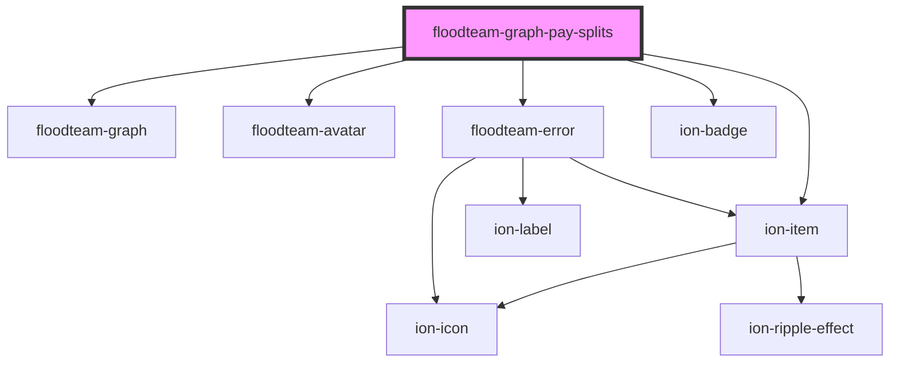

# floodteam-graph-pay-splits

<!-- Auto Generated Below -->

## Properties

| Property     | Attribute     | Description | Type     | Default     |
| ------------ | ------------- | ----------- | -------- | ----------- |
| `graphTitle` | `graph-title` |             | `string` | `undefined` |
| `users`      | --            |             | `any[]`  | `[]`        |

## Methods

### `setUsers(users: any) => Promise<any[]>`

#### Returns

Type: `Promise<any[]>`

## Dependencies

### Depends on

- [floodteam-graph](../graph)
- ion-item
- [floodteam-avatar](../avatar)
- [floodteam-error](../error)
- ion-badge

### Graph

----------------------------------------------

*Built with [StencilJS](https://stenciljs.com/)*
