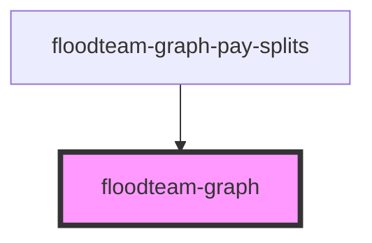

# floodteam-graph

<!-- Auto Generated Below -->

## Properties

| Property   | Attribute | Description                      | Type                                                                                                  | Default     |
| ---------- | --------- | -------------------------------- | ----------------------------------------------------------------------------------------------------- | ----------- |
| `datasets` | --        | The dataset to render graph with | `ChartDataSets[]`                                                                                     | `[]`        |
| `labels`   | --        | The labels for the graph         | `string[]`                                                                                            | `[]`        |
| `name`     | `name`    | The title of the graph           | `string`                                                                                              | `undefined` |
| `type`     | `type`    | The type of graph to generate    | `"area" \| "bar" \| "bubble" \| "doughnut" \| "line" \| "pie" \| "polarArea" \| "radar" \| "scatter"` | `"bar"`     |

## Events

| Event                   | Description                                    | Type                                                                                                                                                                                                                                                                                                                                                                                                                                                                                                                                                                                                                                                                                                                                                                                                                                                    |
| ----------------------- | ---------------------------------------------- | ------------------------------------------------------------------------------------------------------------------------------------------------------------------------------------------------------------------------------------------------------------------------------------------------------------------------------------------------------------------------------------------------------------------------------------------------------------------------------------------------------------------------------------------------------------------------------------------------------------------------------------------------------------------------------------------------------------------------------------------------------------------------------------------------------------------------------------------------------- |
| `floodteamGraphClick`   | Emitted when the graph is clicked              | `CustomEvent<{ event: any; item?: any; }>`                                                                                                                                                                                                                                                                                                                                                                                                                                                                                                                                                                                                                                                                                                                                                                                                              |
| `floodteamGraphTooltip` | Emitted when a tooltip is shown over the graph | `CustomEvent<{ event: { afterBody: any[]; backgroundColor: string; beforeBody: any[]; body: any[]; bodyFontColor: string; bodyFontSize: number; bodySpacing: number; borderColor: string; borderWidth: number; caretPadding: number; caretSize: number; caretX: number; caretY: number; cornerRadius: number; dataPoints: ChartTooltipItem[]; displayColors: boolean; footer: any[]; footerFontColor: string; footerFontSize: number; footerMarginTop: number; footerSpacing: number; height: number; labelColors: ChartTooltipLabelColor[]; labelTextColors: string[]; legendBackgroundColor: string; opacity: number; title: string[]; titleFontColor: string; titleFontSize: number; titleMarinBottom: number; titleSpacing: number; width: number; x: number; xAlign: number; xPadding: number; y: number; yAlign: number; yPadding: number; }; }>` |

## Methods

### `refresh() => Promise<void>`

Refresh the graph

#### Returns

Type: `Promise<void>`

### `removeChart() => Promise<boolean>`

Destroy the ChartJS instance and reset chart on state

#### Returns

Type: `Promise<boolean>`

### `setDatasets(datasets: Chart.ChartDataSets[]) => Promise<any>`

Set the list datasets for the graph

#### Returns

Type: `Promise<any>`

### `setLabels(labels: string[]) => Promise<any>`

Set the list labels for the graph

#### Returns

Type: `Promise<any>`

## Dependencies

### Used by

 - [floodteam-graph-pay-splits](../graph-pay-splits)

### Graph

----------------------------------------------

*Built with [StencilJS](https://stenciljs.com/)*
