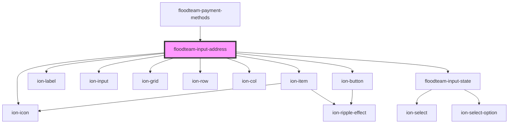

# floodteam-input-address

<!-- Auto Generated Below -->

## Properties

| Property      | Attribute     | Description                              | Type                                                                                                                                                                                      | Default     |
| ------------- | ------------- | ---------------------------------------- | ----------------------------------------------------------------------------------------------------------------------------------------------------------------------------------------- | ----------- |
| `label`       | `label`       | The label of the input field             | `string`                                                                                                                                                                                  | `undefined` |
| `name`        | `name`        | The name attribute of the input          | `string`                                                                                                                                                                                  | `undefined` |
| `placeholder` | `placeholder` | The placeholder text for the input field | `string`                                                                                                                                                                                  | `undefined` |
| `required`    | `required`    | Whether the address input is required    | `boolean`                                                                                                                                                                                 | `undefined` |
| `value`       | --            | The value of the input field             | `{ __typename?: "Address"; placeId?: string; lat?: number; lng?: number; full?: string; street?: string; unit?: string; city?: string; state?: string; zip?: string; country?: string; }` | `{}`        |

## Events

| Event                       | Description | Type               |
| --------------------------- | ----------- | ------------------ |
| `floodteamAddressMode`      |             | `CustomEvent<any>` |
| `floodteamUpdateAutoHeight` |             | `CustomEvent<any>` |
| `ionInput`                  |             | `CustomEvent<any>` |

## Dependencies

### Used by

 - [floodteam-payment-methods](../payment-methods)

### Depends on

- ion-item
- ion-label
- ion-input
- ion-grid
- ion-row
- ion-col
- [floodteam-input-state](../input-state)
- ion-button
- ion-icon

### Graph

----------------------------------------------

*Built with [StencilJS](https://stenciljs.com/)*
