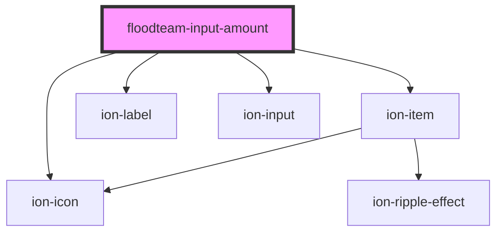

# floodteam-input-amount

<!-- Auto Generated Below -->

## Properties

| Property      | Attribute     | Description | Type                                            | Default     |
| ------------- | ------------- | ----------- | ----------------------------------------------- | ----------- |
| `autofocus`   | `autofocus`   |             | `boolean`                                       | `undefined` |
| `decimal`     | `decimal`     |             | `boolean`                                       | `undefined` |
| `disabled`    | `disabled`    |             | `boolean`                                       | `undefined` |
| `label`       | `label`       |             | `string`                                        | `undefined` |
| `max`         | `max`         |             | `string`                                        | `undefined` |
| `min`         | `min`         |             | `string`                                        | `undefined` |
| `name`        | `name`        |             | `string`                                        | `undefined` |
| `placeholder` | `placeholder` |             | `string`                                        | `undefined` |
| `presets`     | --            |             | `(string \| { label?: string; value: any; })[]` | `undefined` |
| `required`    | `required`    |             | `boolean`                                       | `undefined` |
| `step`        | `step`        |             | `string`                                        | `"0.01"`    |
| `value`       | `value`       |             | `any`                                           | `undefined` |

## Events

| Event       | Description | Type               |
| ----------- | ----------- | ------------------ |
| `ionChange` |             | `CustomEvent<any>` |
| `ionInput`  |             | `CustomEvent<any>` |

## Dependencies

### Depends on

- ion-item
- ion-icon
- ion-label
- ion-input

### Graph

----------------------------------------------

*Built with [StencilJS](https://stenciljs.com/)*
