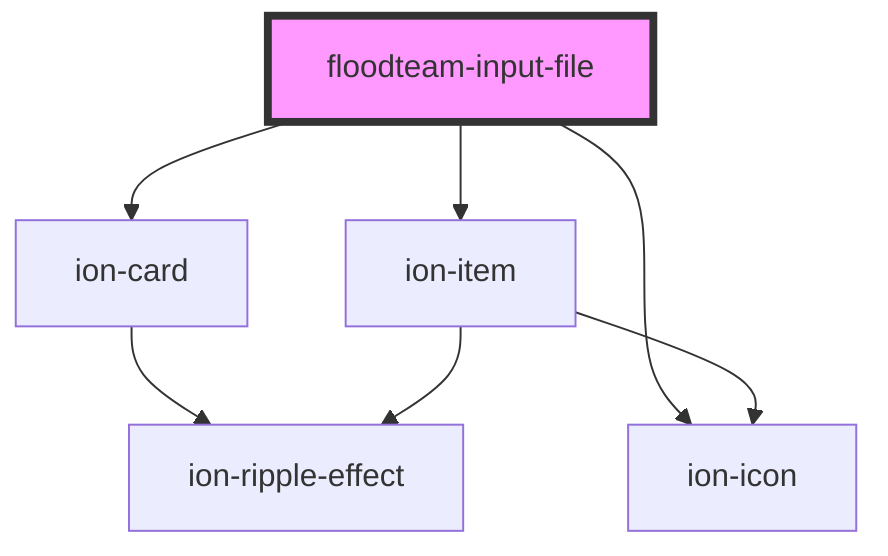

# floodteam-input-file

<!-- Auto Generated Below -->

## Properties

| Property       | Attribute       | Description               | Type     | Default     |
| -------------- | --------------- | ------------------------- | -------- | ----------- |
| `accept`       | `accept`        |                           | `string` | `undefined` |
| `defaultValue` | `default-value` |                           | `any`    | `undefined` |
| `documentId`   | `document-id`   |                           | `string` | `undefined` |
| `endpoint`     | `endpoint`      | The endpoint to upload to | `string` | `"upload"`  |
| `fileName`     | `file-name`     |                           | `string` | `undefined` |
| `icon`         | `icon`          |                           | `string` | `undefined` |
| `label`        | `label`         |                           | `string` | `undefined` |
| `name`         | `name`          |                           | `string` | `undefined` |
| `path`         | `path`          |                           | `string` | `undefined` |
| `type`         | `type`          |                           | `string` | `"file"`    |
| `value`        | `value`         |                           | `any`    | `undefined` |

## Events

| Event                 | Description | Type               |
| --------------------- | ----------- | ------------------ |
| `floodteamUpload`     |             | `CustomEvent<any>` |
| `floodteamUploadFile` |             | `CustomEvent<any>` |
| `ionInput`            |             | `CustomEvent<any>` |

## Methods

### `openFile() => Promise<any>`

#### Returns

Type: `Promise<any>`

## Dependencies

### Depends on

- ion-card
- ion-item
- ion-icon

### Graph

----------------------------------------------

*Built with [StencilJS](https://stenciljs.com/)*
