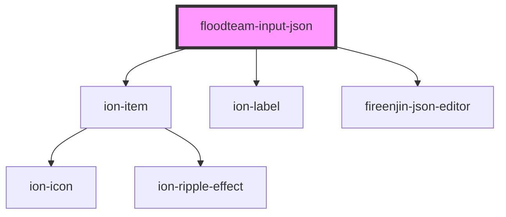

# floodteam-input-json

<!-- Auto Generated Below -->

## Properties

| Property | Attribute | Description | Type  | Default |
| -------- | --------- | ----------- | ----- | ------- |
| `value`  | `value`   |             | `any` | `{}`    |

## Dependencies

### Depends on

- ion-item
- ion-label
- fireenjin-json-editor

### Graph

----------------------------------------------

*Built with [StencilJS](https://stenciljs.com/)*
