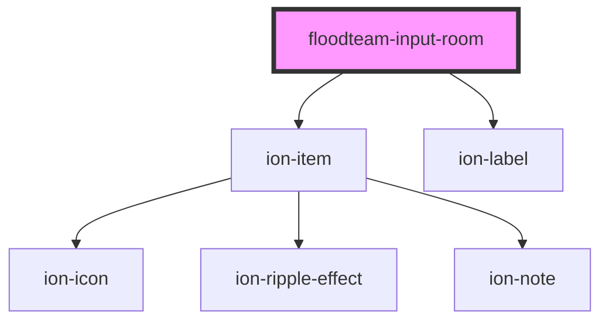

# floodteam-input-room

<!-- Auto Generated Below -->

## Properties

| Property        | Attribute        | Description | Type                                 | Default           |
| --------------- | ---------------- | ----------- | ------------------------------------ | ----------------- |
| `label`         | `label`          |             | `string`                             | `undefined`       |
| `labelPosition` | `label-position` |             | `"fixed" \| "floating" \| "stacked"` | `"stacked"`       |
| `list`          | `list`           |             | `string`                             | `undefined`       |
| `multiple`      | `multiple`       |             | `boolean`                            | `false`           |
| `name`          | `name`           |             | `string`                             | `"name"`          |
| `options`       | --               |             | `{ label: string; value: any; }[]`   | `getRoomNames()`  |
| `placeholder`   | `placeholder`    |             | `string`                             | `"Choose a Room"` |
| `required`      | `required`       |             | `boolean`                            | `false`           |
| `value`         | `value`          |             | `any`                                | `undefined`       |

## Events

| Event       | Description | Type               |
| ----------- | ----------- | ------------------ |
| `ionChange` |             | `CustomEvent<any>` |
| `ionInput`  |             | `CustomEvent<any>` |

## Dependencies

### Depends on

- ion-item
- ion-label

### Graph

----------------------------------------------

*Built with [StencilJS](https://stenciljs.com/)*
