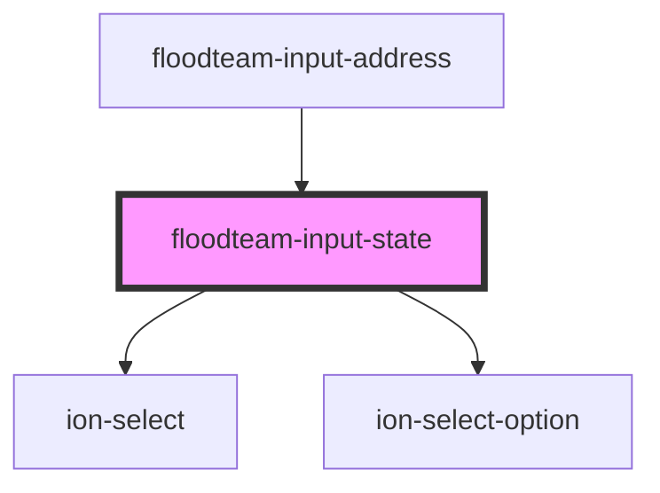

# floodteam-input-state

<!-- Auto Generated Below -->

## Properties

| Property      | Attribute     | Description | Type     | Default     |
| ------------- | ------------- | ----------- | -------- | ----------- |
| `name`        | `name`        |             | `string` | `undefined` |
| `placeholder` | `placeholder` |             | `string` | `undefined` |
| `value`       | `value`       |             | `string` | `undefined` |

## Dependencies

### Used by

 - [floodteam-input-address](../input-address)

### Depends on

- ion-select
- ion-select-option

### Graph

----------------------------------------------

*Built with [StencilJS](https://stenciljs.com/)*
