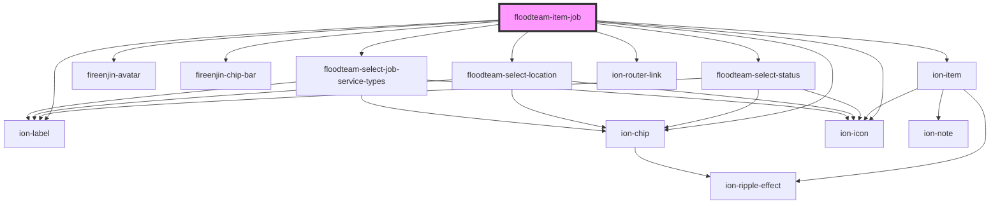

# floodteam-item-job

<!-- Auto Generated Below -->

## Properties

| Property  | Attribute  | Description | Type                          | Default     |
| --------- | ---------- | ----------- | ----------------------------- | ----------- |
| `isAdmin` | `is-admin` |             | `boolean`                     | `false`     |
| `job`     | `job`      |             | `any`                         | `undefined` |
| `lines`   | `lines`    |             | `"full" \| "inset" \| "none"` | `"inset"`   |

## Dependencies

### Depends on

- ion-item
- fireenjin-avatar
- ion-label
- fireenjin-chip-bar
- [floodteam-select-status](../select-status)
- [floodteam-select-location](../select-location)
- ion-chip
- ion-icon
- ion-router-link
- [floodteam-select-job-service-types](../select-job-service-types)

### Graph

----------------------------------------------

*Built with [StencilJS](https://stenciljs.com/)*
