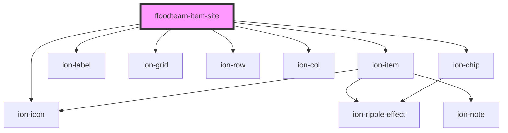

# floodteam-item-site

<!-- Auto Generated Below -->

## Properties

| Property   | Attribute  | Description | Type      | Default     |
| ---------- | ---------- | ----------- | --------- | ----------- |
| `detail`   | `detail`   |             | `boolean` | `true`      |
| `disabled` | `disabled` |             | `boolean` | `false`     |
| `href`     | `href`     |             | `string`  | `undefined` |
| `site`     | `site`     |             | `any`     | `undefined` |

## Events

| Event                        | Description | Type               |
| ---------------------------- | ----------- | ------------------ |
| `floodteamOpenSiteEditModal` |             | `CustomEvent<any>` |

## Dependencies

### Depends on

- ion-item
- ion-label
- ion-grid
- ion-row
- ion-col
- ion-chip
- ion-icon

### Graph

----------------------------------------------

*Built with [StencilJS](https://stenciljs.com/)*
