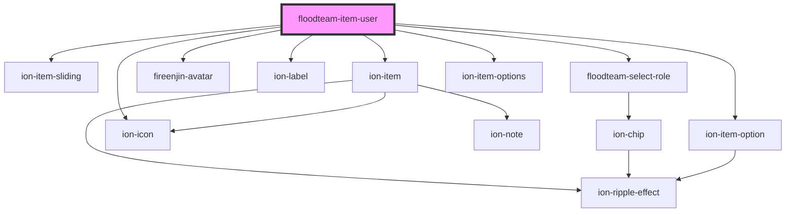

# floodteam-item-user

<!-- Auto Generated Below -->

## Properties

| Property   | Attribute  | Description | Type      | Default     |
| ---------- | ---------- | ----------- | --------- | ----------- |
| `disabled` | `disabled` |             | `boolean` | `false`     |
| `jobId`    | `job-id`   |             | `string`  | `undefined` |
| `role`     | `role`     |             | `string`  | `undefined` |
| `user`     | `user`     |             | `any`     | `undefined` |

## Events

| Event             | Description | Type                                |
| ----------------- | ----------- | ----------------------------------- |
| `fireenjinSubmit` |             | `CustomEvent<FireEnjinSubmitEvent>` |

## Dependencies

### Depends on

- ion-item-sliding
- ion-item
- fireenjin-avatar
- ion-label
- [floodteam-select-role](../select-role)
- ion-item-options
- ion-item-option
- ion-icon

### Graph

----------------------------------------------

*Built with [StencilJS](https://stenciljs.com/)*
