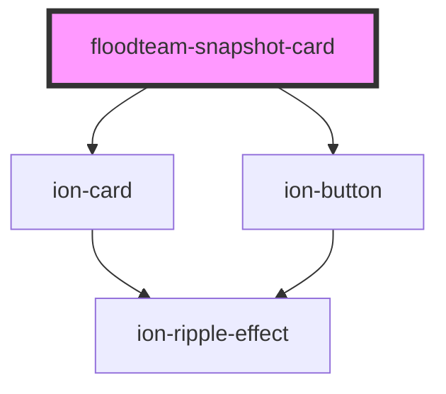

# floodteam-snapshot-card

<!-- Auto Generated Below -->

## Properties

| Property        | Attribute        | Description | Type      | Default     |
| --------------- | ---------------- | ----------- | --------- | ----------- |
| `active`        | `active`         |             | `boolean` | `false`     |
| `buttonProps`   | --               |             | `{}`      | `{}`        |
| `buttonText`    | `button-text`    |             | `string`  | `undefined` |
| `disableShrink` | `disable-shrink` |             | `boolean` | `false`     |
| `href`          | `href`           |             | `string`  | `undefined` |
| `photo`         | `photo`          |             | `string`  | `undefined` |

## Events

| Event            | Description | Type               |
| ---------------- | ----------- | ------------------ |
| `floodteamClick` |             | `CustomEvent<any>` |

## Dependencies

### Depends on

- ion-card
- ion-button

### Graph

----------------------------------------------

*Built with [StencilJS](https://stenciljs.com/)*
