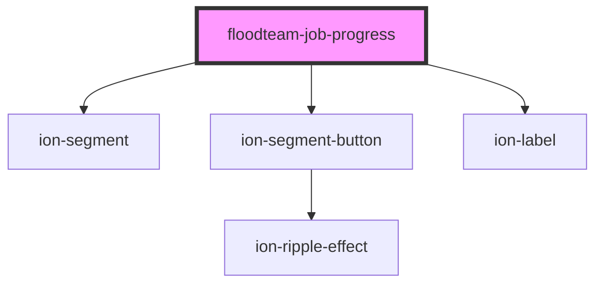

# floodteam-job-progress

<!-- Auto Generated Below -->

## Properties

| Property     | Attribute    | Description | Type                                                                                                                                             | Default                                           |
| ------------ | ------------ | ----------- | ------------------------------------------------------------------------------------------------------------------------------------------------ | ------------------------------------------------- |
| `color`      | `color`      |             | `"danger" \| "dark" \| "light" \| "medium" \| "primary" \| "secondary" \| "success" \| "tertiary" \| "warning" \| string & Record<never, never>` | `"success"`                                       |
| `name`       | `name`       |             | `string`                                                                                                                                         | `"status"`                                        |
| `scrollable` | `scrollable` |             | `boolean`                                                                                                                                        | `true`                                            |
| `statuses`   | --           |             | `string[]`                                                                                                                                       | `["respond", "evaluate", "map", "dry", "review"]` |
| `value`      | `value`      |             | `string`                                                                                                                                         | `"respond"`                                       |

## Dependencies

### Depends on

- ion-segment
- ion-segment-button
- ion-label

### Graph

----------------------------------------------

*Built with [StencilJS](https://stenciljs.com/)*
