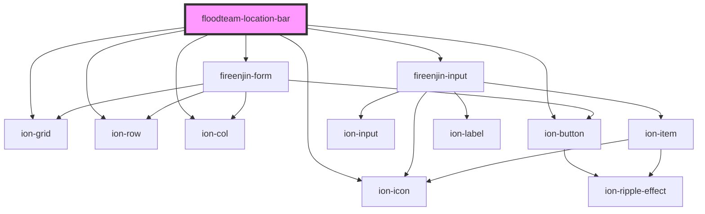

# floodteam-location-bar

<!-- Auto Generated Below -->

## Properties

| Property           | Attribute            | Description | Type     | Default                              |
| ------------------ | -------------------- | ----------- | -------- | ------------------------------------ |
| `algoliaAppId`     | `algolia-app-id`     |             | `string` | `"ZKFP93O6EH"`                       |
| `algoliaIndex`     | `algolia-index`      |             | `string` | `"locations"`                        |
| `algoliaSearchKey` | `algolia-search-key` |             | `string` | `"cef2b52143823594c9c5af78ad86bcf0"` |
| `query`            | `query`              |             | `string` | `undefined`                          |

## Dependencies

### Depends on

- ion-grid
- ion-row
- ion-col
- ion-icon
- fireenjin-form
- fireenjin-input
- ion-button

### Graph

----------------------------------------------

*Built with [StencilJS](https://stenciljs.com/)*
