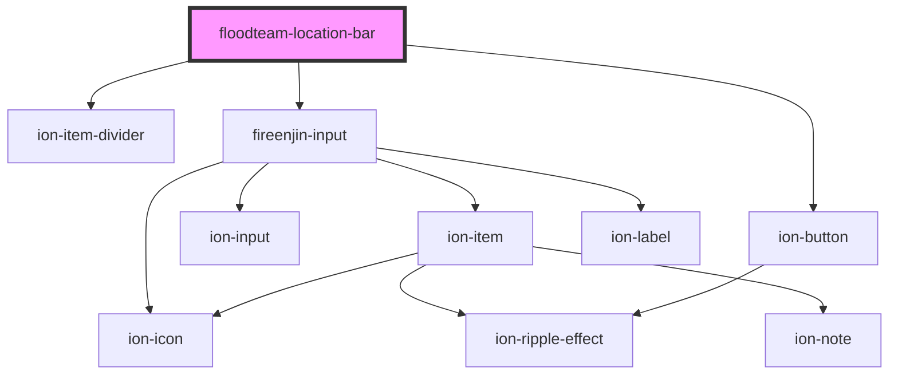

# floodteam-location-bar

<!-- Auto Generated Below -->

## Properties

| Property           | Attribute            | Description | Type     | Default                              |
| ------------------ | -------------------- | ----------- | -------- | ------------------------------------ |
| `algoliaAppId`     | `algolia-app-id`     |             | `string` | `"ZKFP93O6EH"`                       |
| `algoliaIndex`     | `algolia-index`      |             | `string` | `"locations"`                        |
| `algoliaSearchKey` | `algolia-search-key` |             | `string` | `"cef2b52143823594c9c5af78ad86bcf0"` |
| `locationId`       | `location-id`        |             | `string` | `undefined`                          |
| `query`            | `query`              |             | `any`    | `undefined`                          |

## Methods

### `findLocation(id: string) => Promise<{ objectID?: string; name?: string; path?: string; id?: string; email?: string; phone?: string; type?: string; address?: any; isSearchable?: boolean; createdAt?: number; updatedAt?: number; _geoloc?: { lat: string; lng: string; }; taxId?: string; lastModified?: number; }>`

#### Returns

Type: `Promise<{ objectID?: string; name?: string; path?: string; id?: string; email?: string; phone?: string; type?: string; address?: any; isSearchable?: boolean; createdAt?: number; updatedAt?: number; _geoloc?: { lat: string; lng: string; }; taxId?: string; lastModified?: number; }>`

### `search(query: any, options: any) => Promise<any>`

#### Returns

Type: `Promise<any>`

## Dependencies

### Depends on

- ion-item-divider
- fireenjin-input
- ion-button

### Graph

----------------------------------------------

*Built with [StencilJS](https://stenciljs.com/)*
