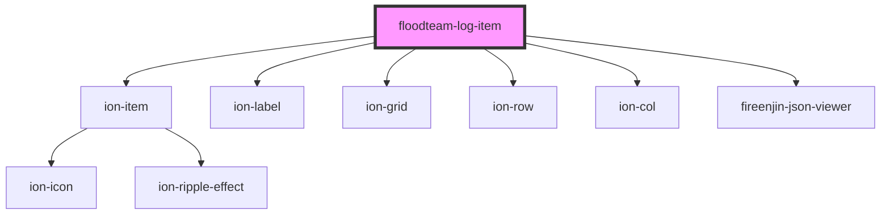

# floodteam-log-item

<!-- Auto Generated Below -->

## Properties

| Property      | Attribute      | Description | Type     | Default     |
| ------------- | -------------- | ----------- | -------- | ----------- |
| `createdAt`   | `created-at`   |             | `string` | `undefined` |
| `input`       | `input`        |             | `string` | `undefined` |
| `name`        | `name`         |             | `string` | `undefined` |
| `output`      | `output`       |             | `string` | `undefined` |
| `resolveTime` | `resolve-time` |             | `number` | `undefined` |
| `type`        | `type`         |             | `string` | `undefined` |

## Dependencies

### Depends on

- ion-item
- ion-label
- ion-grid
- ion-row
- ion-col
- fireenjin-json-viewer

### Graph

----------------------------------------------

*Built with [StencilJS](https://stenciljs.com/)*
