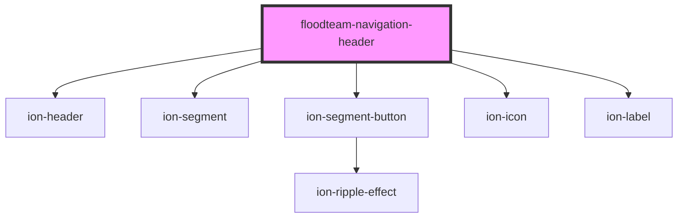

# floodteam-navigation-header

<!-- Auto Generated Below -->

## Properties

| Property         | Attribute         | Description | Type      | Default     |
| ---------------- | ----------------- | ----------- | --------- | ----------- |
| `isLoggedIn`     | `is-logged-in`    |             | `boolean` | `false`     |
| `navigationView` | `navigation-view` |             | `string`  | `undefined` |

## Events

| Event              | Description | Type                                 |
| ------------------ | ----------- | ------------------------------------ |
| `fireenjinTrigger` |             | `CustomEvent<FireEnjinTriggerInput>` |

## Dependencies

### Depends on

- ion-header
- ion-segment
- ion-segment-button
- ion-icon
- ion-label

### Graph

----------------------------------------------

*Built with [StencilJS](https://stenciljs.com/)*
