# floodteam-navigation-menu

<!-- Auto Generated Below -->

## Properties

| Property         | Attribute          | Description | Type      | Default     |
| ---------------- | ------------------ | ----------- | --------- | ----------- |
| `feedFetchData`  | `feed-fetch-data`  |             | `any`     | `undefined` |
| `isAdmin`        | `is-admin`         |             | `boolean` | `false`     |
| `isInternalTeam` | `is-internal-team` |             | `boolean` | `false`     |
| `isLoggedIn`     | `is-logged-in`     |             | `boolean` | `false`     |
| `jobId`          | `job-id`           |             | `string`  | `undefined` |
| `locationId`     | `location-id`      |             | `string`  | `undefined` |
| `locations`      | --                 |             | `any[]`   | `undefined` |
| `navigationView` | `navigation-view`  |             | `string`  | `undefined` |
| `pins`           | --                 |             | `any[]`   | `undefined` |
| `profile`        | `profile`          |             | `any`     | `undefined` |
| `templates`      | --                 |             | `any[]`   | `undefined` |
| `userId`         | `user-id`          |             | `string`  | `undefined` |

## Events

| Event              | Description | Type                                 |
| ------------------ | ----------- | ------------------------------------ |
| `fireenjinSubmit`  |             | `CustomEvent<FireEnjinSubmitEvent>`  |
| `fireenjinTrigger` |             | `CustomEvent<FireEnjinTriggerInput>` |

## Dependencies

### Depends on

- ion-grid
- ion-row
- ion-col
- [floodteam-title-bar](../title-bar)
- ion-router-link
- ion-buttons
- ion-button
- ion-icon
- ion-card
- [floodteam-template](../template)
- fireenjin-form
- fireenjin-pagination
- ion-reorder-group
- ion-item
- ion-label
- ion-reorder
- ion-list
- ion-menu-toggle

### Graph

```mermaid
graph TD;
  floodteam-navigation-menu --> ion-grid
  floodteam-navigation-menu --> ion-row
  floodteam-navigation-menu --> ion-col
  floodteam-navigation-menu --> floodteam-title-bar
  floodteam-navigation-menu --> ion-router-link
  floodteam-navigation-menu --> ion-buttons
  floodteam-navigation-menu --> ion-button
  floodteam-navigation-menu --> ion-icon
  floodteam-navigation-menu --> ion-card
  floodteam-navigation-menu --> floodteam-template
  floodteam-navigation-menu --> fireenjin-form
  floodteam-navigation-menu --> fireenjin-pagination
  floodteam-navigation-menu --> ion-reorder-group
  floodteam-navigation-menu --> ion-item
  floodteam-navigation-menu --> ion-label
  floodteam-navigation-menu --> ion-reorder
  floodteam-navigation-menu --> ion-list
  floodteam-navigation-menu --> ion-menu-toggle
  floodteam-title-bar --> ion-toolbar
  floodteam-title-bar --> ion-buttons
  floodteam-title-bar --> ion-back-button
  floodteam-title-bar --> ion-icon
  floodteam-title-bar --> ion-button
  ion-back-button --> ion-icon
  ion-back-button --> ion-ripple-effect
  ion-button --> ion-ripple-effect
  ion-card --> ion-ripple-effect
  fireenjin-form --> ion-grid
  fireenjin-form --> ion-row
  fireenjin-form --> ion-col
  fireenjin-form --> ion-button
  fireenjin-pagination --> ion-grid
  fireenjin-pagination --> ion-row
  fireenjin-pagination --> ion-col
  fireenjin-pagination --> ion-card
  fireenjin-pagination --> ion-list
  fireenjin-pagination --> ion-virtual-scroll
  fireenjin-pagination --> ion-infinite-scroll
  fireenjin-pagination --> ion-infinite-scroll-content
  ion-infinite-scroll-content --> ion-spinner
  ion-item --> ion-icon
  ion-item --> ion-ripple-effect
  ion-item --> ion-note
  ion-reorder --> ion-icon
  style floodteam-navigation-menu fill:#f9f,stroke:#333,stroke-width:4px
```

----------------------------------------------

*Built with [StencilJS](https://stenciljs.com/)*
