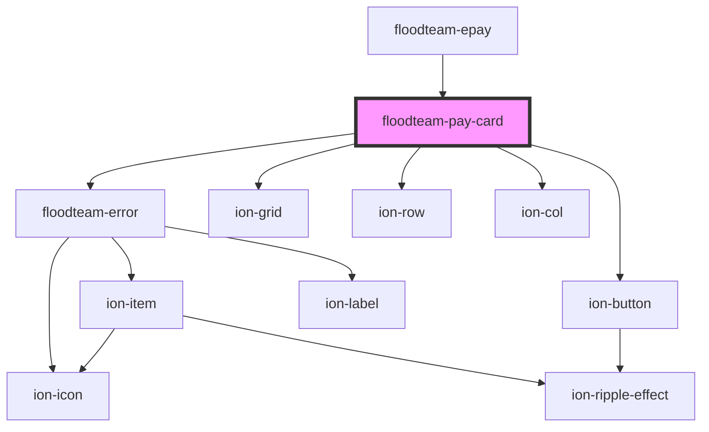

# floodteam-pay-card

<!-- Auto Generated Below -->

## Properties

| Property      | Attribute      | Description | Type     | Default     |
| ------------- | -------------- | ----------- | -------- | ----------- |
| `stripeKey`   | `stripe-key`   |             | `string` | `undefined` |
| `stripeStyle` | `stripe-style` |             | `any`    | `undefined` |

## Events

| Event          | Description | Type               |
| -------------- | ----------- | ------------------ |
| `ftCancel`     |             | `CustomEvent<any>` |
| `ftCardError`  |             | `CustomEvent<any>` |
| `ftSubmitCard` |             | `CustomEvent<any>` |

## Dependencies

### Used by

 - [floodteam-epay](../epay)

### Depends on

- [floodteam-error](../error)
- ion-grid
- ion-row
- ion-col
- ion-button

### Graph

----------------------------------------------

*Built with [StencilJS](https://stenciljs.com/)*
