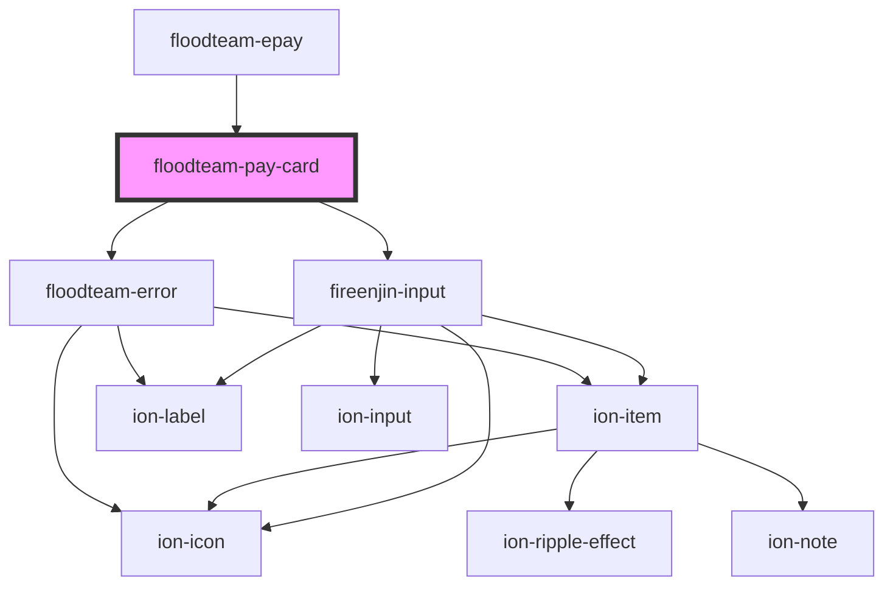

# floodteam-pay-card

<!-- Auto Generated Below -->

## Properties

| Property      | Attribute      | Description | Type      | Default                                                                                                                                                                                                                                                                                                                                                                                                                                                                                                                                                                                                   |
| ------------- | -------------- | ----------- | --------- | --------------------------------------------------------------------------------------------------------------------------------------------------------------------------------------------------------------------------------------------------------------------------------------------------------------------------------------------------------------------------------------------------------------------------------------------------------------------------------------------------------------------------------------------------------------------------------------------------------- |
| `darkMode`    | `dark-mode`    |             | `boolean` | `null`                                                                                                                                                                                                                                                                                                                                                                                                                                                                                                                                                                                                    |
| `stripeKey`   | `stripe-key`   |             | `string`  | `undefined`                                                                                                                                                                                                                                                                                                                                                                                                                                                                                                                                                                                               |
| `stripeStyle` | `stripe-style` |             | `any`     | `{     base: {       color:         this.darkMode ??         (window.matchMedia &&           window.matchMedia("(prefers-color-scheme: dark)").matches)           ? "#FFFFFF"           : "#000000",       iconSize: "30px",       iconColor: "#999999",       lineHeight: "20px",       fontFamily: '"Work Sans", sans-serif',       fontSmoothing: "antialiased",       fontSize: "18px",       "::placeholder": {         color: "#999999",         iconColor: "#999999",         fontWeight: "normal",       },     },     invalid: {       color: "#ee6274",       iconColor: "#ee6274",     },   }` |

## Events

| Event          | Description | Type               |
| -------------- | ----------- | ------------------ |
| `ftCancel`     |             | `CustomEvent<any>` |
| `ftCardError`  |             | `CustomEvent<any>` |
| `ftSubmitCard` |             | `CustomEvent<any>` |

## Methods

### `getCardToken() => Promise<any>`

#### Returns

Type: `Promise<any>`

## Dependencies

### Used by

 - [floodteam-epay](../epay)

### Depends on

- [floodteam-error](../error)
- fireenjin-input

### Graph

----------------------------------------------

*Built with [StencilJS](https://stenciljs.com/)*
