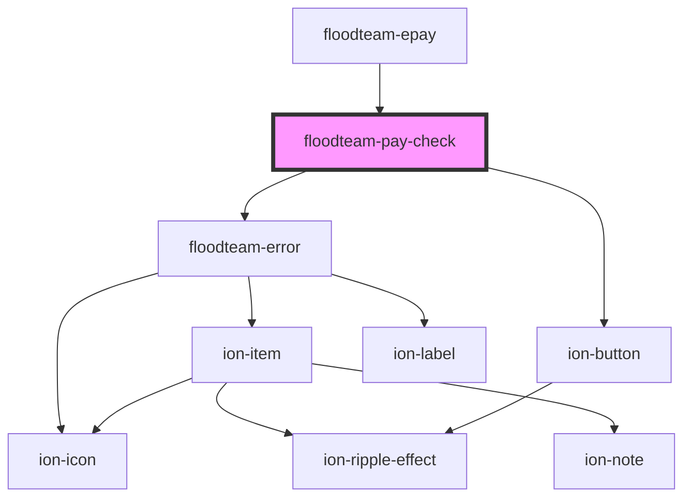

# floodteam-pay-check

<!-- Auto Generated Below -->

## Properties

| Property    | Attribute    | Description | Type      | Default     |
| ----------- | ------------ | ----------- | --------- | ----------- |
| `amount`    | `amount`     |             | `number`  | `undefined` |
| `apiKey`    | `api-key`    |             | `string`  | `undefined` |
| `loading`   | `loading`    |             | `boolean` | `false`     |
| `paymentId` | `payment-id` |             | `string`  | `undefined` |
| `url`       | `url`        |             | `string`  | `undefined` |
| `userId`    | `user-id`    |             | `string`  | `undefined` |

## Events

| Event                 | Description | Type               |
| --------------------- | ----------- | ------------------ |
| `ftCancel`            |             | `CustomEvent<any>` |
| `ftCheckConfirmation` |             | `CustomEvent<any>` |
| `ftCheckError`        |             | `CustomEvent<any>` |
| `ftCheckScan`         |             | `CustomEvent<any>` |
| `ftSubmitCheck`       |             | `CustomEvent<any>` |

## Methods

### `confirmPayment(options?: {}) => Promise<any>`

#### Returns

Type: `Promise<any>`

### `flipCard() => Promise<void>`

#### Returns

Type: `Promise<void>`

### `openCamera(scanningBack?: boolean) => Promise<void>`

#### Returns

Type: `Promise<void>`

## Dependencies

### Used by

 - [floodteam-epay](../epay)

### Depends on

- [floodteam-error](../error)
- ion-button

### Graph

----------------------------------------------

*Built with [StencilJS](https://stenciljs.com/)*
