# floodteam-payment-methods

<!-- Auto Generated Below -->

## Properties

| Property        | Attribute         | Description | Type                   | Default     |
| --------------- | ----------------- | ----------- | ---------------------- | ----------- |
| `address`       | `address`         |             | `any`                  | `{}`        |
| `cardName`      | `card-name`       |             | `string`               | `undefined` |
| `googleMapsKey` | `google-maps-key` |             | `string`               | `undefined` |
| `methods`       | --                |             | `any[]`                | `undefined` |
| `payType`       | `pay-type`        |             | `"card" \| "checking"` | `"card"`    |
| `sessionId`     | `session-id`      |             | `string`               | `undefined` |
| `stripeKey`     | `stripe-key`      |             | `string`               | `undefined` |
| `userId`        | `user-id`         |             | `string`               | `undefined` |

## Events

| Event             | Description | Type                                |
| ----------------- | ----------- | ----------------------------------- |
| `fireenjinFetch`  |             | `CustomEvent<FireEnjinFetchEvent>`  |
| `fireenjinSubmit` |             | `CustomEvent<FireEnjinSubmitEvent>` |

## Dependencies

### Depends on

- ion-card
- [floodteam-error](../error)
- ion-slides
- ion-slide
- ion-list
- ion-item
- ion-label
- ion-button
- ion-icon
- ion-grid
- ion-row
- ion-col
- fireenjin-form
- fireenjin-input
- fireenjin-input-address
- [floodteam-checkmark](../checkmark)

### Graph

```mermaid
graph TD;
  floodteam-payment-methods --> ion-card
  floodteam-payment-methods --> floodteam-error
  floodteam-payment-methods --> ion-slides
  floodteam-payment-methods --> ion-slide
  floodteam-payment-methods --> ion-list
  floodteam-payment-methods --> ion-item
  floodteam-payment-methods --> ion-label
  floodteam-payment-methods --> ion-button
  floodteam-payment-methods --> ion-icon
  floodteam-payment-methods --> ion-grid
  floodteam-payment-methods --> ion-row
  floodteam-payment-methods --> ion-col
  floodteam-payment-methods --> fireenjin-form
  floodteam-payment-methods --> fireenjin-input
  floodteam-payment-methods --> fireenjin-input-address
  floodteam-payment-methods --> floodteam-checkmark
  ion-card --> ion-ripple-effect
  floodteam-error --> ion-item
  floodteam-error --> ion-icon
  floodteam-error --> ion-label
  ion-item --> ion-icon
  ion-item --> ion-ripple-effect
  ion-item --> ion-note
  ion-button --> ion-ripple-effect
  fireenjin-form --> ion-grid
  fireenjin-form --> ion-row
  fireenjin-form --> ion-col
  fireenjin-form --> ion-button
  fireenjin-input --> ion-input
  fireenjin-input --> ion-item
  fireenjin-input --> ion-icon
  fireenjin-input --> ion-label
  fireenjin-input-address --> ion-item
  fireenjin-input-address --> ion-label
  fireenjin-input-address --> ion-input
  fireenjin-input-address --> ion-grid
  fireenjin-input-address --> ion-row
  fireenjin-input-address --> ion-col
  fireenjin-input-address --> fireenjin-input-state
  fireenjin-input-address --> ion-button
  fireenjin-input-state --> ion-select
  fireenjin-input-state --> ion-select-option
  ion-select --> ion-select-popover
  ion-select --> ion-popover
  ion-select --> ion-action-sheet
  ion-select --> ion-alert
  ion-select-popover --> ion-item
  ion-select-popover --> ion-checkbox
  ion-select-popover --> ion-label
  ion-select-popover --> ion-radio-group
  ion-select-popover --> ion-radio
  ion-select-popover --> ion-list
  ion-select-popover --> ion-list-header
  ion-popover --> ion-backdrop
  ion-action-sheet --> ion-backdrop
  ion-action-sheet --> ion-icon
  ion-action-sheet --> ion-ripple-effect
  ion-alert --> ion-ripple-effect
  ion-alert --> ion-backdrop
  floodteam-checkmark --> ion-icon
  style floodteam-payment-methods fill:#f9f,stroke:#333,stroke-width:4px
```

----------------------------------------------

*Built with [StencilJS](https://stenciljs.com/)*
