# floodteam-payment-methods

<!-- Auto Generated Below -->

## Properties

| Property    | Attribute    | Description | Type                                                                                                                                                                                      | Default     |
| ----------- | ------------ | ----------- | ----------------------------------------------------------------------------------------------------------------------------------------------------------------------------------------- | ----------- |
| `address`   | --           |             | `{ __typename?: "Address"; placeId?: string; lat?: number; lng?: number; full?: string; street?: string; unit?: string; city?: string; state?: string; zip?: string; country?: string; }` | `{}`        |
| `cardName`  | `card-name`  |             | `string`                                                                                                                                                                                  | `undefined` |
| `methods`   | --           |             | `any[]`                                                                                                                                                                                   | `undefined` |
| `payType`   | `pay-type`   |             | `"card" \| "checking"`                                                                                                                                                                    | `"card"`    |
| `stripeKey` | `stripe-key` |             | `string`                                                                                                                                                                                  | `undefined` |
| `userId`    | `user-id`    |             | `string`                                                                                                                                                                                  | `undefined` |

## Events

| Event                   | Description | Type               |
| ----------------------- | ----------- | ------------------ |
| `ftRemovePaymentMethod` |             | `CustomEvent<any>` |

## Dependencies

### Depends on

- ion-card
- [floodteam-error](../error)
- ion-slides
- ion-slide
- ion-list
- ion-item
- ion-label
- ion-button
- ion-icon
- ion-grid
- ion-row
- ion-col
- [floodteam-input](../input)
- [floodteam-input-address](../input-address)
- [floodteam-thumbs-up](../thumbs-up)

### Graph

```mermaid
graph TD;
  floodteam-payment-methods --> ion-card
  floodteam-payment-methods --> floodteam-error
  floodteam-payment-methods --> ion-slides
  floodteam-payment-methods --> ion-slide
  floodteam-payment-methods --> ion-list
  floodteam-payment-methods --> ion-item
  floodteam-payment-methods --> ion-label
  floodteam-payment-methods --> ion-button
  floodteam-payment-methods --> ion-icon
  floodteam-payment-methods --> ion-grid
  floodteam-payment-methods --> ion-row
  floodteam-payment-methods --> ion-col
  floodteam-payment-methods --> floodteam-input
  floodteam-payment-methods --> floodteam-input-address
  floodteam-payment-methods --> floodteam-thumbs-up
  ion-card --> ion-ripple-effect
  floodteam-error --> ion-item
  floodteam-error --> ion-icon
  floodteam-error --> ion-label
  ion-item --> ion-icon
  ion-item --> ion-ripple-effect
  ion-button --> ion-ripple-effect
  floodteam-input --> ion-input
  floodteam-input --> ion-item
  floodteam-input --> ion-icon
  floodteam-input --> ion-label
  floodteam-input-address --> ion-item
  floodteam-input-address --> ion-label
  floodteam-input-address --> ion-input
  floodteam-input-address --> ion-grid
  floodteam-input-address --> ion-row
  floodteam-input-address --> ion-col
  floodteam-input-address --> floodteam-input-state
  floodteam-input-address --> ion-button
  floodteam-input-address --> ion-icon
  floodteam-input-state --> ion-select
  floodteam-input-state --> ion-select-option
  floodteam-thumbs-up --> ion-icon
  style floodteam-payment-methods fill:#f9f,stroke:#333,stroke-width:4px
```

----------------------------------------------

*Built with [StencilJS](https://stenciljs.com/)*
