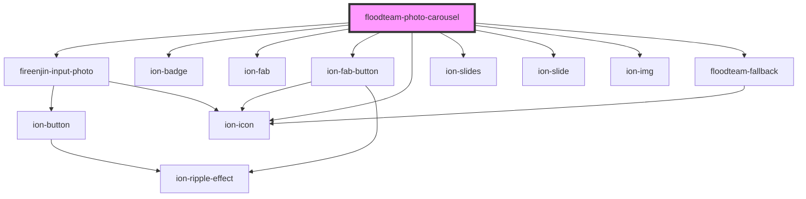

# floodteam-photo-carousel

<!-- Auto Generated Below -->

## Properties

| Property         | Attribute          | Description | Type      | Default           |
| ---------------- | ------------------ | ----------- | --------- | ----------------- |
| `addButtonColor` | `add-button-color` |             | `string`  | `"primary"`       |
| `badgeColor`     | `badge-color`      |             | `string`  | `"medium"`        |
| `currentSlide`   | `current-slide`    |             | `number`  | `0`               |
| `hideAddButton`  | `hide-add-button`  |             | `boolean` | `false`           |
| `jobId`          | `job-id`           |             | `string`  | `undefined`       |
| `name`           | `name`             |             | `string`  | `"photocarousel"` |
| `options`        | `options`          |             | `any`     | `{}`              |
| `photos`         | --                 |             | `any[]`   | `[]`              |
| `siteId`         | `site-id`          |             | `string`  | `undefined`       |
| `type`           | `type`             |             | `string`  | `"site"`          |

## Methods

### `getCurrentSlide() => Promise<number>`

#### Returns

Type: `Promise<number>`

### `selectFiles(event: any) => Promise<any>`

#### Returns

Type: `Promise<any>`

### `slideNext() => Promise<void>`

#### Returns

Type: `Promise<void>`

### `slidePrev() => Promise<void>`

#### Returns

Type: `Promise<void>`

### `slideTo(slideNumber: number) => Promise<void>`

#### Returns

Type: `Promise<void>`

### `update() => Promise<void>`

#### Returns

Type: `Promise<void>`

## Dependencies

### Depends on

- fireenjin-input-photo
- ion-badge
- ion-fab
- ion-fab-button
- ion-icon
- ion-slides
- ion-slide
- ion-img
- [floodteam-fallback](../fallback)

### Graph

----------------------------------------------

*Built with [StencilJS](https://stenciljs.com/)*
