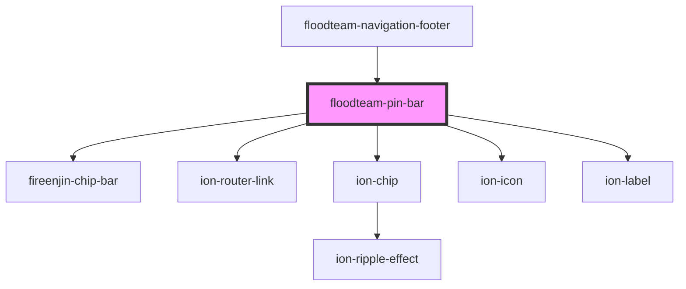

# floodteam-pin-bar

<!-- Auto Generated Below -->

## Properties

| Property  | Attribute | Description | Type      | Default     |
| --------- | --------- | ----------- | --------- | ----------- |
| `pins`    | --        |             | `any[]`   | `undefined` |
| `profile` | `profile` |             | `any`     | `undefined` |
| `reorder` | `reorder` |             | `boolean` | `false`     |

## Events

| Event              | Description | Type                                 |
| ------------------ | ----------- | ------------------------------------ |
| `fireenjinTrigger` |             | `CustomEvent<FireEnjinTriggerInput>` |

## Dependencies

### Used by

 - [floodteam-navigation-footer](../navigation-footer)

### Depends on

- fireenjin-chip-bar
- ion-router-link
- ion-chip
- ion-icon
- ion-label

### Graph

----------------------------------------------

*Built with [StencilJS](https://stenciljs.com/)*
