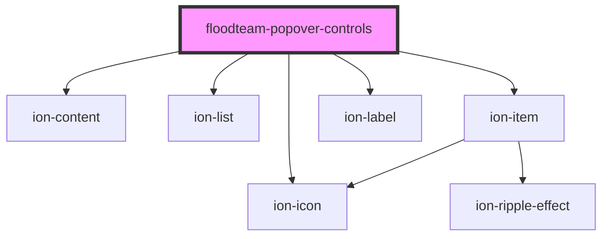

# floodteam-popover-controls

<!-- Auto Generated Below -->

## Properties

| Property     | Attribute | Description                                                     | Type                                                                                               | Default |
| ------------ | --------- | --------------------------------------------------------------- | -------------------------------------------------------------------------------------------------- | ------- |
| `buttonList` | --        | The list of buttons to show when the material button is clicked | `{ label: string; icon: string; color?: string; href?: string; onClick?: (event: any) => any; }[]` | `[]`    |

## Events

| Event                   | Description | Type               |
| ----------------------- | ----------- | ------------------ |
| `floodteamClosePopover` |             | `CustomEvent<any>` |

## Dependencies

### Depends on

- ion-content
- ion-list
- ion-item
- ion-icon
- ion-label

### Graph

----------------------------------------------

*Built with [StencilJS](https://stenciljs.com/)*
