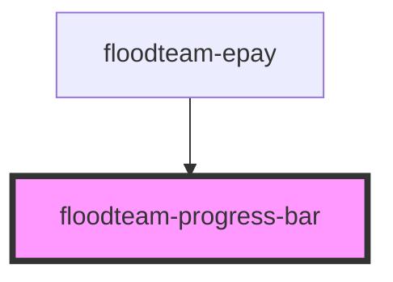

# floodteam-progress-bar

<!-- Auto Generated Below -->

## Properties

| Property  | Attribute | Description                                         | Type     | Default |
| --------- | --------- | --------------------------------------------------- | -------- | ------- |
| `percent` | `percent` | The percent of the progress bar that will be filled | `number` | `0`     |

## Methods

### `setPercent(percent: number) => Promise<number>`

Set the progress bar completion percentage

#### Returns

Type: `Promise<number>`

## CSS Custom Properties

| Name                                             | Description                                        |
| ------------------------------------------------ | -------------------------------------------------- |
| `--floodteam-progess-bar-fill-transition`        | The transtion settings for the fill bar            |
| `--floodteam-progress-bar-background-color`      | The background color of the progress bar           |
| `--floodteam-progress-bar-border-radius`         | The border radius of the progress bar and fill bar |
| `--floodteam-progress-bar-fill-background-color` | The color of the progress bar fill                 |
| `--floodteam-progress-bar-fill-width`            | The percent amount to fill the progress bar        |
| `--floodteam-progress-bar-height`                | The height of the progress bar                     |
| `--floodteam-progress-bar-width`                 | The width of the progress bar                      |
| `--transition`                                   | Transition of the button                           |

## Dependencies

### Used by

 - [floodteam-epay](../epay)

### Graph

----------------------------------------------

*Built with [StencilJS](https://stenciljs.com/)*
