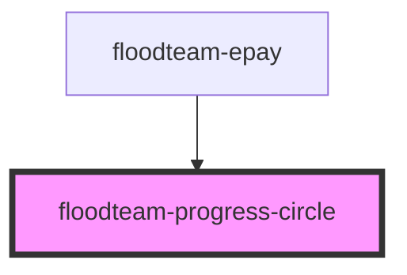

# floodteam-progress-circle

<!-- Auto Generated Below -->

## Properties

| Property  | Attribute | Description                                            | Type     | Default |
| --------- | --------- | ------------------------------------------------------ | -------- | ------- |
| `percent` | `percent` | The percent value of progress filled between 0 and 100 | `number` | `0`     |
| `radius`  | `radius`  | The radius size of the circle in pixels                | `number` | `60`    |
| `stroke`  | `stroke`  | The stroke thickness of the progress bar               | `number` | `5`     |

## Dependencies

### Used by

 - [floodteam-epay](../epay)

### Graph

----------------------------------------------

*Built with [StencilJS](https://stenciljs.com/)*
