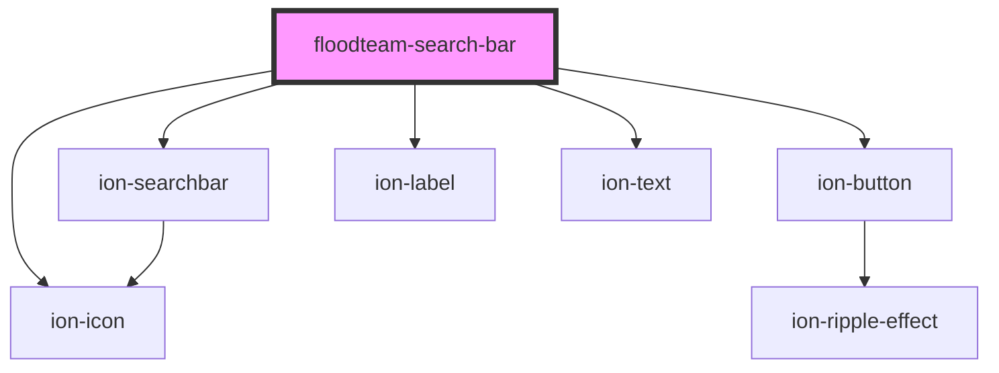

# floodteam-search-bar

<!-- Auto Generated Below -->

## Properties

| Property           | Attribute            | Description | Type                                                                                                                                                                                                                                                                                                                                                                                                                                                                                                                                                                                         | Default     |
| ------------------ | -------------------- | ----------- | -------------------------------------------------------------------------------------------------------------------------------------------------------------------------------------------------------------------------------------------------------------------------------------------------------------------------------------------------------------------------------------------------------------------------------------------------------------------------------------------------------------------------------------------------------------------------------------------- | ----------- |
| `beforeGetResults` | `before-get-results` |             | `any`                                                                                                                                                                                                                                                                                                                                                                                                                                                                                                                                                                                        | `undefined` |
| `disableSearch`    | `disable-search`     |             | `boolean`                                                                                                                                                                                                                                                                                                                                                                                                                                                                                                                                                                                    | `false`     |
| `displayMode`      | `display-mode`       |             | `"grid" \| "list"`                                                                                                                                                                                                                                                                                                                                                                                                                                                                                                                                                                           | `"grid"`    |
| `filter`           | --                   |             | `{ label?: string; controls: { resultsKey?: string; name: string; icon?: string; label?: string; value?: any; header?: string; subHeader?: string; message?: string; optionEl?: (result: any) => any; endpoint?: string; query?: string; limit?: number; orderBy?: string; dataPropsMap?: any; params?: any; multiple?: boolean; disabled?: boolean; cancelText?: string; okText?: string; placeholder?: string; selectedText?: string; interface?: SelectInterface; interfaceOptions?: any; compareWith?: string \| SelectCompareFn; options?: { label: string; value: string; }[]; }[]; }` | `undefined` |
| `modeToggle`       | `mode-toggle`        |             | `boolean`                                                                                                                                                                                                                                                                                                                                                                                                                                                                                                                                                                                    | `false`     |
| `paginationEl`     | `pagination-el`      |             | `any`                                                                                                                                                                                                                                                                                                                                                                                                                                                                                                                                                                                        | `undefined` |
| `sort`             | --                   |             | `{ label?: string; value?: string; header?: string; subHeader?: string; message?: string; options: { label: string; value: string; }[]; }`                                                                                                                                                                                                                                                                                                                                                                                                                                                   | `undefined` |

## Methods

### `clearFilter(event: any, clearingControl: { resultsKey?: string; name: string; icon?: string; label?: string; value?: any; header?: string; subHeader?: string; message?: string; optionEl?: (result: any) => any; endpoint?: string; query?: string; limit?: number; orderBy?: string; dataPropsMap?: any; params?: any; multiple?: boolean; disabled?: boolean; cancelText?: string; okText?: string; placeholder?: string; selectedText?: string; interface?: SelectInterface; interfaceOptions?: any; compareWith?: string | SelectCompareFn | null; options?: { label: string; value: string; }[]; }) => Promise<void>`

#### Returns

Type: `Promise<void>`

### `createFilterPopover(event?: any) => Promise<HTMLIonPopoverElement>`

#### Returns

Type: `Promise<HTMLIonPopoverElement>`

### `openFilterPopover(event: any) => Promise<void>`

#### Returns

Type: `Promise<void>`

### `togglePaginationDisplay() => Promise<void>`

#### Returns

Type: `Promise<void>`

## Dependencies

### Depends on

- ion-searchbar
- ion-button
- ion-icon
- ion-label
- ion-text

### Graph

----------------------------------------------

*Built with [StencilJS](https://stenciljs.com/)*
