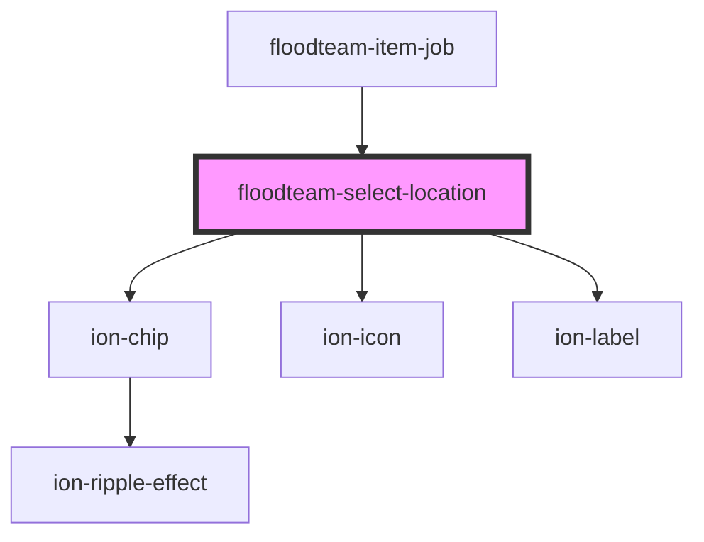

# floodteam-select-location

<!-- Auto Generated Below -->

## Properties

| Property    | Attribute  | Description | Type      | Default     |
| ----------- | ---------- | ----------- | --------- | ----------- |
| `disabled`  | `disabled` |             | `boolean` | `false`     |
| `jobId`     | `job-id`   |             | `string`  | `undefined` |
| `locations` | --         |             | `any[]`   | `undefined` |
| `name`      | `name`     |             | `string`  | `"status"`  |
| `value`     | `value`    |             | `string`  | `undefined` |

## Events

| Event              | Description | Type                                 |
| ------------------ | ----------- | ------------------------------------ |
| `fireenjinSubmit`  |             | `CustomEvent<FireEnjinSubmitEvent>`  |
| `fireenjinTrigger` |             | `CustomEvent<FireEnjinTriggerInput>` |

## Dependencies

### Used by

 - [floodteam-item-job](../item-job)

### Depends on

- ion-chip
- ion-icon
- ion-label

### Graph

----------------------------------------------

*Built with [StencilJS](https://stenciljs.com/)*
