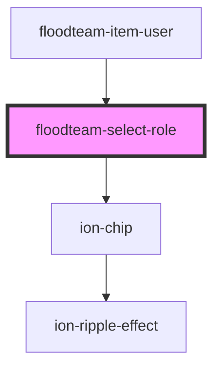

# floodteam-select-role

<!-- Auto Generated Below -->

## Properties

| Property   | Attribute  | Description | Type      | Default     |
| ---------- | ---------- | ----------- | --------- | ----------- |
| `disabled` | `disabled` |             | `boolean` | `false`     |
| `jobId`    | `job-id`   |             | `string`  | `undefined` |
| `name`     | `name`     |             | `string`  | `"role"`    |
| `userId`   | `user-id`  |             | `string`  | `undefined` |
| `value`    | `value`    |             | `string`  | `undefined` |

## Events

| Event              | Description | Type                                 |
| ------------------ | ----------- | ------------------------------------ |
| `fireenjinSubmit`  |             | `CustomEvent<FireEnjinSubmitEvent>`  |
| `fireenjinTrigger` |             | `CustomEvent<FireEnjinTriggerInput>` |

## Dependencies

### Used by

 - [floodteam-item-user](../item-user)

### Depends on

- ion-chip

### Graph

----------------------------------------------

*Built with [StencilJS](https://stenciljs.com/)*
