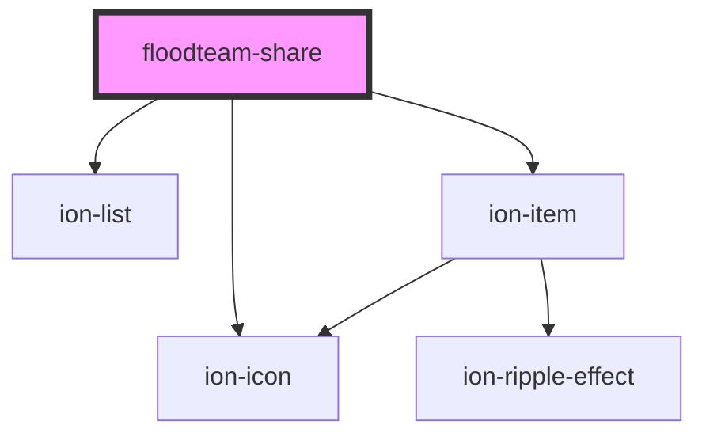

# floodteam-share

<!-- Auto Generated Below -->

## Properties

| Property  | Attribute | Description | Type                                              | Default         |
| --------- | --------- | ----------- | ------------------------------------------------- | --------------- |
| `options` | --        |             | `{ url: string; text?: string; title?: string; }` | `{ url: null }` |

## Events

| Event           | Description | Type               |
| --------------- | ----------- | ------------------ |
| `tmgShareClose` |             | `CustomEvent<any>` |

## Dependencies

### Depends on

- ion-list
- ion-item
- ion-icon

### Graph

----------------------------------------------

*Built with [StencilJS](https://stenciljs.com/)*
