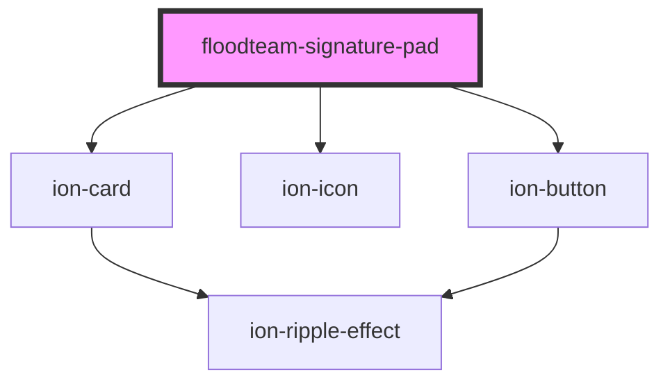

# floodteam-signature-pad

<!-- Auto Generated Below -->

## Properties

| Property               | Attribute                | Description                                                                                   | Type     | Default                |
| ---------------------- | ------------------------ | --------------------------------------------------------------------------------------------- | -------- | ---------------------- |
| `backgroundColor`      | `background-color`       | The background color for the signature pad                                                    | `string` | `"rgb(255, 255, 255)"` |
| `clearText`            | `clear-text`             | The text to display on the clear button                                                       | `string` | `"Clear"`              |
| `dotSize`              | `dot-size`               | Radius of a single dot                                                                        | `number` | `undefined`            |
| `label`                | `label`                  | The label to display below signature pad                                                      | `string` | `"Sign Above"`         |
| `maxWidth`             | `max-width`              | Maximum width of a line                                                                       | `number` | `0.5`                  |
| `minDistance`          | `min-distance`           | Add the next point only if the previous one is farther than x pixels                          | `number` | `5`                    |
| `minWidth`             | `min-width`              | Minimum width of a line                                                                       | `number` | `0.5`                  |
| `name`                 | `name`                   | The name of the element                                                                       | `string` | `"signature"`          |
| `penColor`             | `pen-color`              | Color used to draw the lines. Can be any color format accepted by context.fillStyle           | `string` | `"black"`              |
| `submitText`           | `submit-text`            | The text to display on the submit button                                                      | `string` | `"Submit"`             |
| `throttle`             | `throttle`               | Draw the next point at most once per every x milliseconds. Set it to 0 to turn off throttling | `number` | `16`                   |
| `value`                | `value`                  | The current data for the signature pad                                                        | `any`    | `undefined`            |
| `velocityFilterWeight` | `velocity-filter-weight` | Weight used to modify new velocity based on the previous velocity                             | `number` | `0.7`                  |

## Events

| Event       | Description | Type               |
| ----------- | ----------- | ------------------ |
| `ionChange` |             | `CustomEvent<any>` |
| `ionInput`  |             | `CustomEvent<any>` |

## Methods

### `clear() => Promise<any>`

#### Returns

Type: `Promise<any>`

### `download(dataURL: any, filename: any) => Promise<void>`

#### Returns

Type: `Promise<void>`

### `downloadJPG() => Promise<void>`

#### Returns

Type: `Promise<void>`

### `downloadPNG() => Promise<void>`

#### Returns

Type: `Promise<void>`

### `downloadSVG() => Promise<void>`

#### Returns

Type: `Promise<void>`

### `fromData(data: any) => Promise<any>`

#### Returns

Type: `Promise<any>`

### `isEmpty() => Promise<any>`

#### Returns

Type: `Promise<any>`

### `resizeCanvas() => Promise<void>`

#### Returns

Type: `Promise<void>`

### `submit() => Promise<void>`

#### Returns

Type: `Promise<void>`

### `toData() => Promise<any>`

#### Returns

Type: `Promise<any>`

### `undo() => Promise<any>`

#### Returns

Type: `Promise<any>`

## Dependencies

### Depends on

- ion-card
- ion-icon
- ion-button

### Graph

----------------------------------------------

*Built with [StencilJS](https://stenciljs.com/)*
