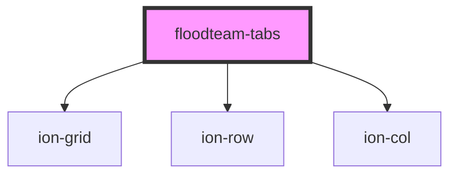

# floodteam-tabs

<!-- Auto Generated Below -->

## Properties

| Property   | Attribute  | Description | Type      | Default     |
| ---------- | ---------- | ----------- | --------- | ----------- |
| `hash`     | `hash`     |             | `boolean` | `undefined` |
| `selected` | `selected` |             | `string`  | `undefined` |

## Events

| Event                | Description | Type               |
| -------------------- | ----------- | ------------------ |
| `floodteamTabChange` |             | `CustomEvent<any>` |

## Dependencies

### Depends on

- ion-grid
- ion-row
- ion-col

### Graph

----------------------------------------------

*Built with [StencilJS](https://stenciljs.com/)*
