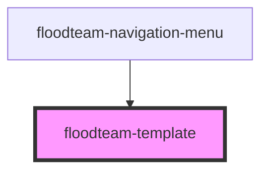

# floodteam-template

<!-- Auto Generated Below -->

## Properties

| Property          | Attribute          | Description | Type      | Default     |
| ----------------- | ------------------ | ----------- | --------- | ----------- |
| `allowFullscreen` | `allow-fullscreen` |             | `boolean` | `false`     |
| `data`            | `data`             |             | `any`     | `undefined` |
| `disableFrame`    | `disable-frame`    |             | `boolean` | `false`     |
| `disablePosition` | `disable-position` |             | `boolean` | `false`     |
| `helpers`         | `helpers`          |             | `any`     | `undefined` |
| `partials`        | --                 |             | `any[]`   | `undefined` |
| `rawHtml`         | `raw-html`         |             | `string`  | `undefined` |
| `resize`          | `resize`           |             | `boolean` | `false`     |
| `template`        | `template`         |             | `any`     | `undefined` |
| `templateId`      | `template-id`      |             | `string`  | `undefined` |
| `zoom`            | `zoom`             |             | `number`  | `1`         |

## Dependencies

### Used by

 - [floodteam-navigation-menu](../navigation-menu)

### Graph

----------------------------------------------

*Built with [StencilJS](https://stenciljs.com/)*
