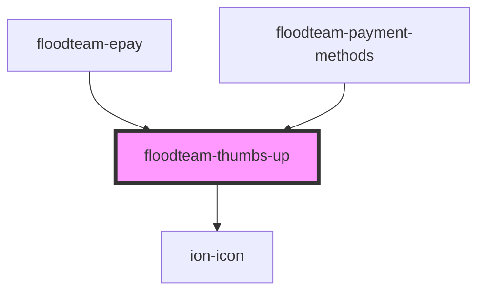

# floodteam-thumbs-up

<!-- Auto Generated Below -->

## Properties

| Property    | Attribute   | Description           | Type      | Default   |
| ----------- | ----------- | --------------------- | --------- | --------- |
| `animating` | `animating` | Start the animation   | `boolean` | `false`   |
| `size`      | `size`      | The size of the thumb | `string`  | `"150px"` |

## Dependencies

### Used by

 - [floodteam-epay](../epay)
 - [floodteam-payment-methods](../payment-methods)

### Depends on

- ion-icon

### Graph

----------------------------------------------

*Built with [StencilJS](https://stenciljs.com/)*
