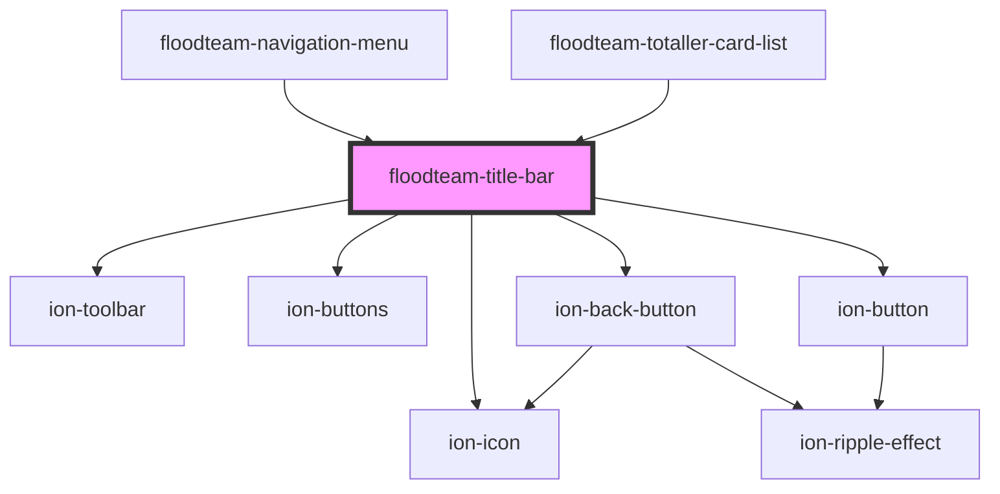

# floodteam-title-bar

<!-- Auto Generated Below -->

## Properties

| Property           | Attribute           | Description | Type      | Default     |
| ------------------ | ------------------- | ----------- | --------- | ----------- |
| `back`             | `back`              |             | `string`  | `undefined` |
| `disableUnderline` | `disable-underline` |             | `boolean` | `false`     |
| `heading`          | `heading`           |             | `number`  | `1`         |
| `icon`             | `icon`              |             | `string`  | `undefined` |
| `pin`              | `pin`               |             | `any`     | `undefined` |
| `pins`             | --                  |             | `any[]`   | `undefined` |

## Events

| Event              | Description | Type                                 |
| ------------------ | ----------- | ------------------------------------ |
| `fireenjinTrigger` |             | `CustomEvent<FireEnjinTriggerInput>` |

## Dependencies

### Used by

 - [floodteam-navigation-menu](../navigation-menu)
 - [floodteam-totaller-card-list](../totaller-card-list)

### Depends on

- ion-toolbar
- ion-buttons
- ion-back-button
- ion-icon
- ion-button

### Graph

----------------------------------------------

*Built with [StencilJS](https://stenciljs.com/)*
