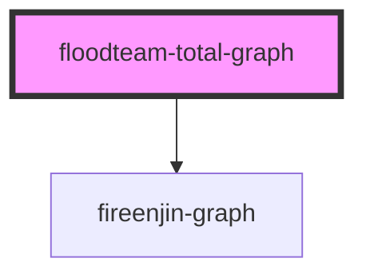

# floodteam-total-graph

<!-- Auto Generated Below -->

## Properties

| Property     | Attribute     | Description | Type                       | Default     |
| ------------ | ------------- | ----------- | -------------------------- | ----------- |
| `dataSets`   | --            |             | `any[]`                    | `[]`        |
| `groupBy`    | `group-by`    |             | `string`                   | `"month"`   |
| `labels`     | --            |             | `string[]`                 | `[]`        |
| `totaller`   | `totaller`    |             | `any`                      | `undefined` |
| `totallerId` | `totaller-id` |             | `string`                   | `undefined` |
| `type`       | `type`        |             | `"bar" \| "line" \| "pie"` | `"line"`    |

## Events

| Event            | Description | Type                               |
| ---------------- | ----------- | ---------------------------------- |
| `fireenjinFetch` |             | `CustomEvent<FireEnjinFetchEvent>` |

## Dependencies

### Depends on

- fireenjin-graph

### Graph

----------------------------------------------

*Built with [StencilJS](https://stenciljs.com/)*
