# floodteam-totaller-card-list

<!-- Auto Generated Below -->

## Properties

| Property      | Attribute  | Description | Type     | Default      |
| ------------- | ---------- | ----------- | -------- | ------------ |
| `groupBy`     | `group-by` |             | `string` | `"month"`    |
| `label`       | `label`    |             | `string` | `undefined`  |
| `timeframe`   | --         |             | `Date`   | `new Date()` |
| `totallerIds` | --         |             | `any[]`  | `undefined`  |

## Events

| Event            | Description | Type                               |
| ---------------- | ----------- | ---------------------------------- |
| `fireenjinFetch` |             | `CustomEvent<FireEnjinFetchEvent>` |

## Dependencies

### Depends on

- [floodteam-title-bar](../title-bar)
- fireenjin-select
- fireenjin-chip-bar
- ion-chip
- ion-icon
- fireenjin-input
- [floodteam-totaller-cards](../totaller-cards)

### Graph

```mermaid
graph TD;
  floodteam-totaller-card-list --> floodteam-title-bar
  floodteam-totaller-card-list --> fireenjin-select
  floodteam-totaller-card-list --> fireenjin-chip-bar
  floodteam-totaller-card-list --> ion-chip
  floodteam-totaller-card-list --> ion-icon
  floodteam-totaller-card-list --> fireenjin-input
  floodteam-totaller-card-list --> floodteam-totaller-cards
  floodteam-title-bar --> ion-toolbar
  floodteam-title-bar --> ion-buttons
  floodteam-title-bar --> ion-back-button
  floodteam-title-bar --> ion-icon
  floodteam-title-bar --> ion-button
  ion-back-button --> ion-icon
  ion-back-button --> ion-ripple-effect
  ion-button --> ion-ripple-effect
  fireenjin-select --> ion-item
  fireenjin-select --> ion-icon
  fireenjin-select --> ion-label
  fireenjin-select --> ion-select
  fireenjin-select --> ion-select-option
  ion-item --> ion-icon
  ion-item --> ion-ripple-effect
  ion-item --> ion-note
  ion-select --> ion-select-popover
  ion-select --> ion-popover
  ion-select --> ion-action-sheet
  ion-select --> ion-alert
  ion-select-popover --> ion-item
  ion-select-popover --> ion-checkbox
  ion-select-popover --> ion-label
  ion-select-popover --> ion-radio-group
  ion-select-popover --> ion-radio
  ion-select-popover --> ion-list
  ion-select-popover --> ion-list-header
  ion-popover --> ion-backdrop
  ion-action-sheet --> ion-backdrop
  ion-action-sheet --> ion-icon
  ion-action-sheet --> ion-ripple-effect
  ion-alert --> ion-ripple-effect
  ion-alert --> ion-backdrop
  ion-chip --> ion-ripple-effect
  fireenjin-input --> ion-input
  fireenjin-input --> ion-item
  fireenjin-input --> ion-icon
  fireenjin-input --> ion-label
  floodteam-totaller-cards --> ion-card
  ion-card --> ion-ripple-effect
  style floodteam-totaller-card-list fill:#f9f,stroke:#333,stroke-width:4px
```

----------------------------------------------

*Built with [StencilJS](https://stenciljs.com/)*
